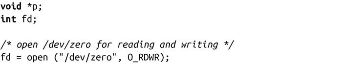
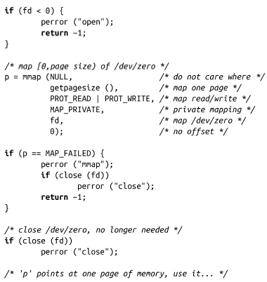

### 9.4.2　映射到设备文件/dev/zero

其他UNIX系统（例如BSD），并没有MAP_ANONYMOUS标记位。相反，它们通过映射到特殊的设备文件/dev/zero，实现了一个类似的解决方案。设备文件/dev/zero提供了和匿名内存完全相同的语义。/dev/zero是一个包含全0的页的映射，采取写时复制方式，因此其行为和匿名存储器一致。

Linux一直支持/dev/zero设备，可以通过映射这个文件来获得全0的内存块。实际上，在引入MAP_ANONYMOUS之前，Linux编程人员就使用类似BSD的方法。为了对早期的Linux版本提供向后兼容，或是为了移植到其他UNIX系统上，编程人员还是可以映射到/dev/zero文件，来实现创建匿名映射。映射到/dev/zero文件与映射到其他文件，在语法上没什么区别：

当然，通过这种映射方式的内存可以使用munmap()函数来取消映射。

但是，这种方法由于要打开和关闭设备文件，所以会有额外的系统调用开销。因此，匿名内存映射是一种较快的方法。

