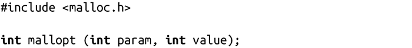
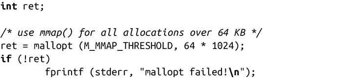
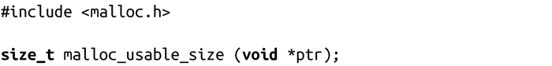
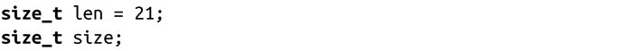
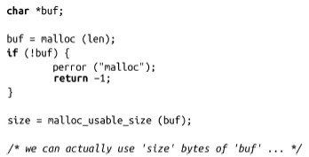
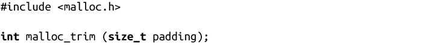

### 9.5　高级内存分配

本章所涉及的很多内存分配操作都受到glibc或内核的参数所限制和控制，编程人员可以使用mallopt()函数修改这些参数：

调用mallopt()会将由param指定的存储管理相关的参数的值设为value。成功时，调用返回一个非0值；失败时，返回0。注意，mallopt()不会设置errno值。一般来说，它都会正常返回，所以不要认为一定可以从返回值中获得有用的信息。

Linux目前支持6种param值，都在<malloc.h>中定义：

M_CHECK_ACTION

环境变量MALLOC_CHECK_的值（将在下一节讨论）。

M_MMAP_MAX

系统用来满足动态内存请求的最大内存映射数。当达到这个限制时，分配就只能在数据段中进行，直到其中一个映射被释放。当该值为0时，将禁止使用匿名映射来实现动态存储的分配。

M_MMAP_THRESHOLD

该阈值决定该用匿名映射还是用数据段来满足存储器分配请求（以字节为单位）。需要注意的是，有时候系统为了慎重起见，就算分配的内存空间比该阈值小，也有可能会使用匿名映射来满足动态内存分配。当值为0时，就会对所有的分配请求都启用匿名映射，而不再使用数据段。

M_MXFAST

fast bin的最大大小（以字节为单位）。fast bins是堆中特殊的内存块，永远不和临近的内存块合并，也永远不归还给系统，以增加碎片为代价来满足高速的内存分配。当值为0时，fast bin将禁止使用。

M_PERTURB

支持内存定位，它可以帮助检测内存管理错误。如果值非0，glibc会把所有分配的字节（除了那些通过calloc()请求的）设置为value值中最后一个字节的逻辑非值。这有助于检测使用前未初始化的错误。此外，glibc还会把所有已释放的字节设置为value值中最后一个字节值。这有助于检测在执行free释放后还使用的错误。

M_TOP_PAD

调整数据段的大小时所使用的填充（padding）字节数。当glibc通过brk()来增加数据段的大小时，它可能申请更多的内存，希望减少很快再次调用brk()的可能性。相似地，当glibc收缩数据段的时候，它会保持一些多余的内存，而不是将所有都归还给系统。这多余的字节即填充的字节。值为0时，会禁止使用填充。

M_TRIM_THRESHOLD

该阈值表示在glibc调用sbrk()把内存返还给内核之前，数据段最上方已释放内存的最少字节数。

XPG标准没有严格定义mallopt()函数，它还指定了其他三个参数：M_GRAIN、M_KEEP和M_NLBLKS。Linux定义了这些参数，但是它们实际上不起任何作用。表9-1定义了所有合法参数，它们的缺省值以及可接受值的范围。

<b class="my_markdown">表9-1　mallopt()参数</b>

| 参　　数 | 来　　源 | 缺 省 值 | 有效值范围 | 特殊值含义 |
| :-----  | :-----  | :-----  | :-----  | :-----  | :-----  | :-----  |
| M_CHECK_ACTION | Linux特有 | 0 | 0-2 |
| M_GRAIN | XPG标准 | Linux不支持 |
| M_KEEP | XPG标准 | Linux不支持 |
| M_MMAP_MAX | Linux特有 | 641 024 | ≥0 | 0禁用mmap() |
| M_MMAP_THRESHOLD | Linux特有 | 1281 024 | ≥0 | 0禁用堆 |
| M_MXFAST | XPG标准 | 64 | 0-80 | 0 禁用fast bins |
| M_NLBLKS | XPG标准 | Linux不支持 | ≥0 |
| M_PERTURB | Linux特有 | 0 | 0或1 | 0禁止PERTURB功能 |
| M_TOP_PAD | Linux特有 | 0 | ≥0 | 0禁用填充 |
| M_TRIM_THRESHOLD | Linux特有 | 1281 024 | ≥-1 | -1禁止截断 |

程序必须要在调用malloc()或其他内存分配函数之前，使用mallopt()，使用方法也非常简单：

使用malloc_usable_size()和malloc_trim()进行调优

Linux提供了一组用来控制glibc内存分配系统的底层函数。第一个函数允许程序查询一块已分配内存中有多少可用字节：

调用malloc_usable_size()成功时，返回ptr指向的动态内存块的实际大小。因为glibc可能扩大动态内存来适应一个已存在的块或匿名映射，动态内存分配中的可使用空间可能会比请求的大。当然，永远不可能比请求的小。下面是一个使用这个函数的例子：

第二个函数允许程序强制glibc归还所有的可释放的动态内存给内核：

调用malloc_trim()成功时，数据段会尽可能地收缩，但是填充字节被保留下来，函数返回1。失败时，返回0。一般来说，每当空闲的内存达到M_TRIM_THRESHOLD 字节时，glibc会自动完成这种数据段收缩。它使用M_TOP_PAD来填充。

除了调试和教学之外，其他地方几乎永远都不要使用这两个函数。它们是不可移植的，而且会将glibc内存分配系统的一些底层细节暴露给应用程序。

