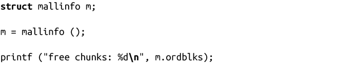
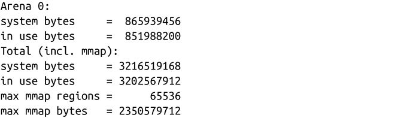

### 9.5.2　获取统计信息

Linux提供了mallinfo()函数，可以获取动态内存分配系统相关的统计信息：

调用mallinfo()会将统计数据保存到结构体mallinfo中。这个结构体是通过值，而不是指针返回的。其字段结构也在<malloc.h>中定义：

用法很简单：

Linux 也提供了malloc_stats()函数，把和内存相关的统计信息打印到标准错误输出（stderr）：

在内存操作频繁的程序中调用malloc_stats()，会生成一些较大的数字：

