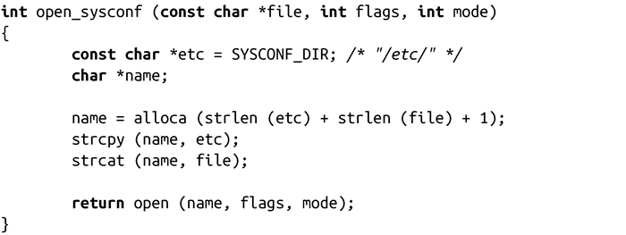
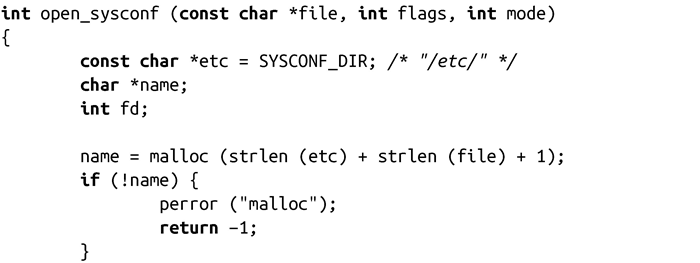
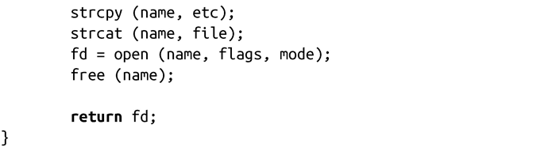

### 9.6　基于栈的分配

到目前为止，我们所讨论的所有动态内存分配机制都是使用堆和内存映射来实现的。由于堆和匿名映射本身就是动态的，所以想到使用它们是很自然的。在程序地址空间中常用的另一个结构体是栈，它用来存放程序的自动变量（automatic variables）。

然而，认为编程人员不能使用栈来进行动态内存分配是毫无理由的。只要分配不会导致栈溢出，使用栈分配的解决方式是简单而完美的。要在一个栈中实现动态内存分配，可以使用系统调用alloca()：

成功时，alloca()调用会返回一个指向size字节大小的内存指针。这块内存是在栈中的，当调用它的函数返回时，这块内存会被自动释放。失败时，某些该函数的实现会返回NULL，但是alloca()在大多数情况下是不会失败或者无法报告失败。失败表现在出现栈溢出。

alloca()的用法和malloc()一样，但不需要（实际上，不允许）释放分配到的内存。以下示例函数，会打开系统配置目录（可能是/etc）下一个给定的文件，该目录可能是/etc，在编译时就确定了。该函数必须申请一块新的缓冲区，把系统配置路径复制到这个缓冲区中，然后将缓冲区和指定文件名关联起来：

在open_sysconf函数返回时，从alloca()分配到的内存会随着栈的释放而被自动释放。这意味着当调用alloca()的函数返回后，就不能再使用由alloca()得到的那块内存！然而，由于这种方式不需要调用free()来完成释放工作，所以最终代码会简洁一些。以下是通过malloc()实现的功能相同的函数：

要注意的是，不要使用alloca()函数分配的内存来作为一个函数调用的参数，因为分配到的内存块会存在于函数参数所保存的栈空间当中。例如，下面这样做是不行的：

alloca()接口有着曲折的历史。在许多系统中，它表现很不好，可能出现未定义行为。在某些系统中，栈大小较小而且固定，使用alloca()很容易导致栈溢出，进而导致程序崩溃。在另外一些系统中，根本就不提供alloca()接口。由于经常出错和版本不一致，人们对alloca()总是没有一个好的印象。

因此，如果希望代码具有可移植性，应该避免使用alloca()。但是，在Linux系统上，alloca()却是一个非常好用的工具，但没有被充分利用。在Linux上，它表现很出色（在很多体系结构下，通过alloca()进行内存分配就和增加栈指针一样简单，性能比malloc()要好很多）。在Linux下，对于较小的内存分配，使用alloca()可以得到很大的性能提升。

