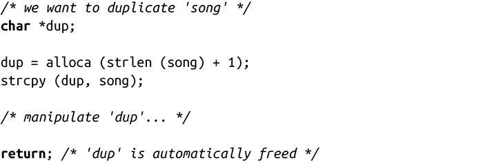
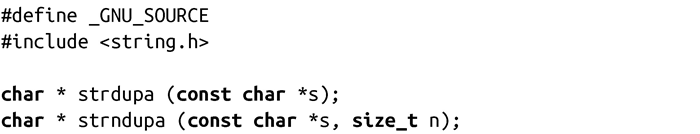

### 9.6.1　把字符串复制到栈中

alloca()最常见的用法是临时复制一个字符串。举个例子：

因为这种需求非常多，而且alloca()在性能上的高效性，Linux系统专门提供了strdup()变体，可以把指定字符串复制到栈中：

调用strdupa( )会返回一份s副本。strndupa()调用会复制字符串s中的前n个字符。如果s的长度大于n，就复制s的前n个字符，函数会自动加上一个空字节。这些函数具有和alloca()相同的优点。当调用的函数返回时，复制的字符串会被自动释放。

POSIX并没有定义alloca( )、strdupa( )或者strndupa( )函数，它们在其他操作系统上的表现也差强人意。如果考虑到可移植性，不鼓励使用这些函数。然而，在Linux上，alloca()及其衍生的一些函数却表现很好，可以通过简单地栈指针移动操作来代替其他一些复杂的动态内存分配方法，带来了性能上的很大提升。

