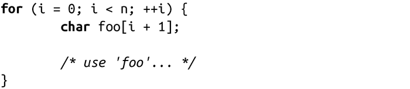
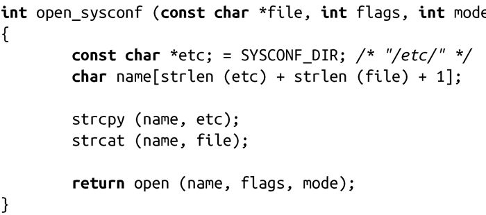

### 9.6.2　变长数组

C99 引进了“变长数组（VLAs）”，变长数组的长度是在运行时决定的，而不是在编译时。在这之前，GNU C已经支持变长数组一段时间了，但是由于C99将其标准化，这很大程度上激励人们使用变长数组。和alloca()相似，VLAs也采用相同的方式来避免动态内存分配所带来的开销。

变长数组的使用方式如下：

在这个代码段中，foo是一个有i+1个char的数组。每次循环时，都会动态创建foo，并在循环结束时自动释放。如果使用alloca()来代替VLA，那内存空间将直到函数返回时才会被释放。使用VLA可以确保每次循环都会释放内存。所以，使用VLA时，最多使用n个字节的内存，而alloca()会使用掉n*(n+1)/2个字节。通过使用变长数组，可以重新实现open_sysconf()函数：

alloca()和变长数组之间的主要区别在于通过前者获得的内存在函数执行过程中始终存在，而通过后者获得的内存在出了作用域后便释放了。这种方式有好有坏。在for循环中，我们希望每次循环都能释放空间，并在没有带来任何副作用的情况下减小内存的开销（不希望有多余的内存始终被占用着）。然而，如果出于某种原因，希望这块空间能保留到下一轮的循环中，那么使用alloca()显然是更加合理的。

> 在函数中混合使用alloca()和变长数组，会给程序带来非预期行为。因此，为了安全起见，在一个函数中只应使用其中之一。

