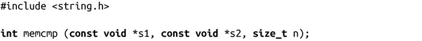
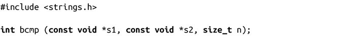
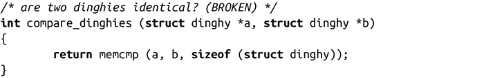
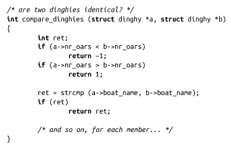

### 9.8.2　字节比较

和strcmp()类似，memcmp()会比较两块内存是否相等：

调用memcmp()会比较s1和s2的前n个字节，如果两块内存相同就返回0，如果s1小于s2就返回一个小于0的数，反之则返回大于0的数。

BSD同样提供了具有类似功能的接口，但该接口现已废弃：

调用bcmp()会比较s1和s2的前n字节，如果两块内存一样，会返回0，否则返回非0值。

由于存在结构填充（见本章9.2.4节提到的“其他对齐问题”），通过memcmp()或bcmp()来比较两个结构体是否相等是不可靠的。同一个结构的两个实例也可能因为有未初始化的填充内容而被判为不相等。因此，下面的代码是不安全的：

编程人员如果想要比较两个结构体，只能一个个比较结构体中的每个元素。下面这个方法实现了一些优化，但它的工作量当然比不安全的memcmp()操作要大得多：

