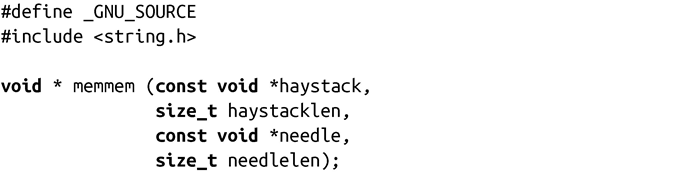

### 9.8.4　字节查找

函数memchr()和memrchr()可以在内存块中查找一个给定的字节：

函数memchr()从s指向的区域开始的n个字节中查找c，c将被转换为unsigned char：

函数返回指向第一个匹配c的字节的指针，如果没找到c则返回NULL。

memrchr()与memchr()类似，不过它是从s指向的内存开始反向搜索n个字节。和memchr()不同，memrchr()是GNU的扩展函数，而不是C语言的一部分。

对于更加复杂的搜索，有个名字很糟糕的函数memmem()，它可以在一块内存中搜索任意的字节数组：

memmem()函数会在长为haystacklen的内存块haystack中查找，返回第一块指向needle子块的指针，长为needlelen。如果函数在haystack中找不到needle子块，它会返回NULL。这个函数同样是GNU的扩展函数。

