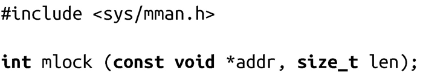

### 9.9.1　锁定部分地址空间

POSIX1003.1b-1993标准定义了两个接口，可以将一个或更多的页面“锁定”在物理内存，以保证它们不会被交换到磁盘。第一个函数锁定给定的一个地址区间：

调用mlock()将锁定addr开始，长度为len个字节的虚拟内存。成功时，函数返回0；失败时，函数返回-1，并会相应设置errno值。

成功调用mlock()函数时，会把所有包含[addr,addr+len)的物理内存页锁定。例如，假设一个调用只是指定了一个字节，包含这个字节的所有物理页都将被锁定。POSIX标准要求addr应该与页边界对齐。Linux并没有强制要求，需要时，会“透明地”将addr向下调整到最近的页面。但是，对于要求可移植到其他系统的程序，需要保证addr是页对齐的。

合法的errno值包括：

EINVAL

参数len是负数。

ENOMEM

函数尝试锁定多于RLIMIT_MEMLOCK限制的页（详见9.9.4节）。

EPERM

RLIMIT_MEMLOCK是0，但进程并没有CAP_IPC_LOCK权限（同样，详见9.9.4节）。

> 一个由fork()产生的子进程并不从父进程处继承锁定的内存。然而，由于Linux对地址空间写时复制机制，子进程的页面被锁定在内存中直到子进程对它们执行写操作。

下面这个例子，假设一个程序在内存中有一个加密的字符串。一个进程可以通过下面代码来锁定拥有这个字符串的页：

