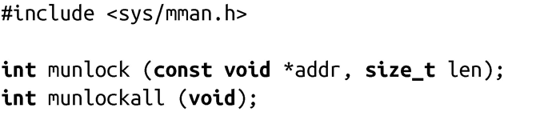

### 9.9.3　内存解锁

POSIX标准提供了两个接口，可以将页从内存中解锁，允许内核根据需要将页换出至硬盘中：

系统调用munlock()，会解除从addr开始，长为len的内存所在的页面的锁定。munlock()函数是取消mlock()的操作效果。而munlockall()则消除mlockall()的效果。两个函数在成功时都返回0，失败时返回-1，并如下设置errno值：

EINVAL

参数 len 是负数（仅对munlock()）。

ENOMEM

被指定的页面中有些是不合法的。

EPERM

RLIMIT_MEMLOCK是0，但进程并没有CAP_IPC_LOCK权限（同样请见“锁限制”部分）。

内存锁定并不会重叠。所以，不管被mlock()或mlockall()锁定了多少次，仅一个mlock()或者munlock()，即会解除一个页面的锁定。

