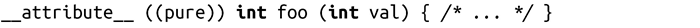
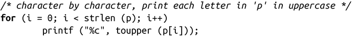
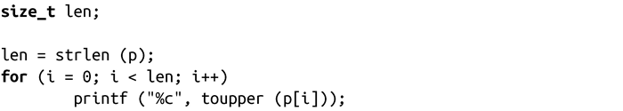
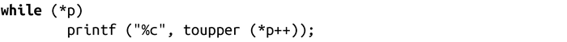

### 纯函数

“纯”函数是指不会带来其他影响，其返回值只受函数参数或nonvolatile全局变量影响。任何参数或全局访问都只支持“只读”模式。循环优化和消除子表达式的场景可以使用纯函数。纯函数是通过关键字pure来标识的：

一个常见的示例是strlen()。只要输入相同，对于多次调用，该函数的返回值都是一样的。因此可以从循环中抽取出来，只调用一次。举个例子，对于下面的代码：

如果编译器不知道strlen()是纯函数，它就会在每次循环迭代时都调用该函数。

有经验的编程人员或编译器，如果认为strlen()是纯函数——就会编写/生成如下代码：

但是，更聪明的编程人员（比如本书的读者）会编写如下代码：

纯函数不能返回void类型，这么做也没有意义，因为返回值是纯函数的“灵魂”。非纯函数的一个示例是random()。

