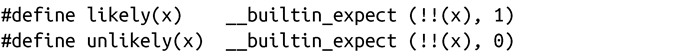
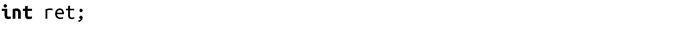
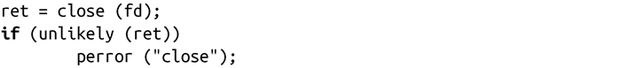
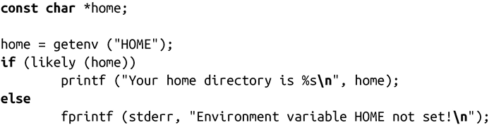

### 分支标注

GCC支持编程人员对表达式的期望值进行标注（annotate）——举个例子，告诉编译器某个条件语句是真的还是假的。GCC可以执行块重新排序和其他优化措施，从而优化条件分支的性能。

GCC对分支标注的语法支持非常糟糕。为了使分支标注看起来更简单，我们使用预处理器宏：

编程人员可以通过把表达式分别封装到likely()和unlikely()中，标识表达式很可能为真，或不太可能为真。

以下示例把分支标识成不太可能为真（也就是说，很可能为假）：

相反，以下示例把分支标识为很可能为真：

在内联函数中，编程人员往往会过多使用分支标注。一旦开始使用表达式，可能会倾向于标识“所有的”表达式。但是，要注意的是，只有当你知道“前提条件（priori）”，而且确定表达式几乎在任何情况下（比如99%）是真的，才可以把分支标识为很可能或基本不可能。有些错误适用于unlikely()。要记住的是，错误的预测还远远不如没有预测。

