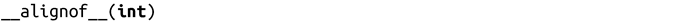
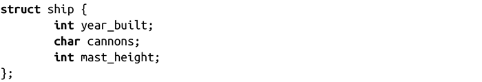
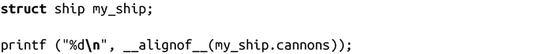

### 获取类型的对齐方式

GCC提供了关键字alignof来获取给定对象的对齐方式。其值是架构和ABI特有的。如果当前架构并没有需要的对齐方式，关键字会返回ABI推荐的对齐方式。否则，关键字会返回最小的对齐值。

其语法和sizeof()完全相同：

其返回值依赖于体系架构，很可能会返回4，因为32位的整数通常是4个字节。

>  **C11和C++11中的alignof()**
> C11和C++11引入了alignof()，其工作方式和alignof()完全相同，但对它进行了标准化。如果编写C11或C++11代码，建议使用alignof()。

该关键字也是作用于左值。也就是说，返回的对齐值是所支持类型的最小对齐方式，而不是某个左值的真正对齐方式。如果通过aligned属性改变最小对齐方式（在本附录前面“增加变量的对齐”一节中描述过），变化是通过__alignof__来表示。

举个例子，对于以下结构体：

和以下代码片段：

该代码片段中的alignof会返回1，虽然结构体对齐填充可能会导致字符cannons占用4个字节。

