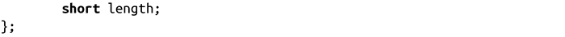

### 结构体中成员变量的偏移

GCC提供内置的关键字，可以获取该结构体内的成员变量的偏移。文件<stddef.h>中定义的宏offsetof()，是ISO C标准的一部分。绝大多数定义很糟糕，涉及粗俗的指针算式算法，不适用于其他少数情况。GCC扩展更简单，而且往往更快：

该调用会返回type类型的member变量的偏移——也就是说，从零开始，从结构体的起始地址到该变量地址之间的字节数。举个例子，对于以下结构体：

实际偏移取决于变量大小和体系结构的对齐和填充行为。在32位计算机上，如果在结构体rowboat上调用offsetof()函数，变量boat_name、nr_oars和length会分别返回0、4和8。

在Linux系统中，offsetof()宏应该通过GCC关键字来定义，而且不需要重新定义。

