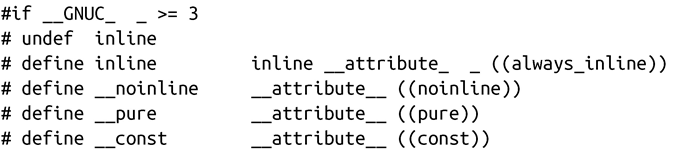
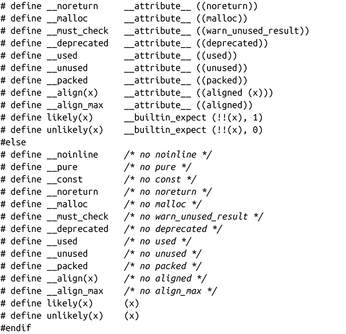

### “一箭双雕”可移植且代码优美

必须承认的是，attribute语法不太美观。本章所探讨的一些扩展为了可读性需要通过预处理器宏来实现，但是这些扩展都可以在某种程度上更优雅一些。

预处理器使得这一切变得简单。此外，在相同的操作中，可以通过在非GCC编译器（不管是什么）的环境下定义，使得GCC扩展可以移植。

为了实现这一点，在头文件中包含下列代码片段，在源文件中包含该头文件：

举个例子，通过以下方式可以标识函数为纯函数，这种方式很简洁：

如果使用GCC，该函数会标识为pure属性。如果GCC不是编译器，预处理器会把__pure项替换成no-op。注意，一个定义可以包含多个属性，因而可以很方便地在单个函数中使用多个定义。

更简单，更优雅，而且可移植性更好！

<a class="my_markdown" href="['#acfa1']">[1]</a> 当两个或多个指针变量指向同一个内存地址时，会发生“内存别名（memory alias）”。这会发生在一些琐碎场景，比如一个指针的值被赋值给另一个指针，也可以发生在更复杂、不那么明显的场景中。如果函数返回新分配内存的地址，该地址不应该存在其他指针。

