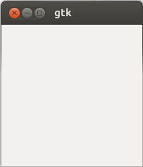

下面程序用于显示一个框框：

**gtk.c**

```c
#include <gtk/gtk.h>

int main(int argc, char *argv[])
{
	GtkWidget *window;
	
	gtk_init(&argc, &argv);
	window = gtk_window_new(GTK_WINDOW_TOPLEVEL);
	gtk_widget_show(window);
	gtk_main();
	
	return 0;
}
```

编译代码：

```shell
$ gcc gtk.c -o gtk `pkg-config --cflags --libs gtk+-2.0`
```

运行代码效果如下：



这个例子的核心代码是对 `gtk_window_new` 的调用，其函数原型是：

```c
GtkWidget* gtk_window_new(GtkWindowType type);
```

参数 `type` 根据窗口的目的可取下面两个值之一：

+ `GTK_WINDOW_TOPLEVEL`：一个标准的有框架窗口。
+ `GTK_WINDOW_POPUP`：一个适用于对话框的无框架窗口。

`gtk_main` 函数通过把控制权交给 GTK+ 来启动交互过程，并且一直运行，直到调用 `gtk_main_quit` 才返回。正如你所看到的，`gtk.c` 并未调用 `gtk_main_quit`，因此，即使窗口被关闭，程序也不会停止。你可以在启动 `gtk` 程序的 `shell` 窗口中按下 <kbd>Ctrl</kbd> + <kbd>C</kbd> 组合键来退出这个程序。