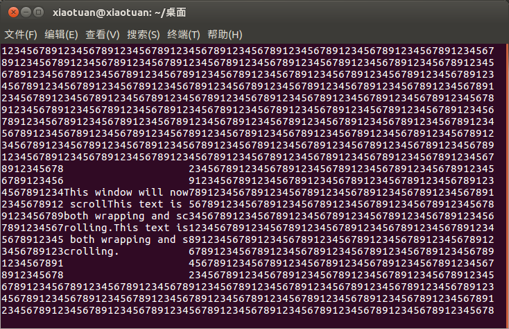

子窗口的创建和删除可以用以下几个函数来完成：

```c
#include <curses.h>

WINDOW *subwin(WINDOW *parent, int num_of_lines, int num_of_cols, int start_y, int start_x);
int delwin(WINDOW *window_to_delete);
```

`subwin` 函数的参数几乎与 `newwin` 函数完全一样，子窗口的删除过程也和其他窗口一样，都是通过调用 `delwin` 函数来完成。如同对待新窗口一样，你可以使用以 `mvw` 为前缀的函数来写子窗口。事实上，在大多数情况下，子窗口的行为与新窗口非常相似，两者之间只有一个重要的区别：子窗口没有自己独立的屏幕字符存储空间，它们与其父窗口（在创建子窗口时指定）共享同一字符存储空间。这意味着，对子窗口中内容的任何修改都会反应到其父窗口中，所以删除子窗口时，屏幕显示不会发生任何变化。

子窗口最主要的用途是，提供了一种简洁的方式来卷动另一窗口里的部分内容。在编写 `curses` 程序时，我们经常会需要卷动屏幕的某个小区域。通过将这个小区域定义为一个子窗口，然后对其进行卷动，就能达到我们想要的效果。

> 注意：使用子窗口有个强加的限制——在应用程序刷新屏幕之前必须先对其父窗口调用 `touchwin` 函数。

**示例程序：subsc.c**

```c
#include <unistd.h>
#include <stdlib.h>
#include <curses.h>

int main()
{
	WINDOW *sub_window_ptr;
	int x_loop;
	int y_loop;
	int counter;
	char a_letter = '1';
	
	initscr();
	
	for (y_loop = 0; y_loop < LINES - 1; y_loop++) {
		for (x_loop = 0; x_loop < COLS - 1; x_loop++) {
			mvwaddch(stdscr, y_loop, x_loop, a_letter);
			a_letter++;
			if (a_letter > '9') a_letter = '1';
		}
	}
	
	sub_window_ptr = subwin(stdscr, 10, 20, 10, 10);
	scrollok(sub_window_ptr, 1);
	
	touchwin(stdscr);
	refresh();
	sleep(1);
	werase(sub_window_ptr);
	mvwprintw(sub_window_ptr, 2, 0, "%s", "This window will now scroll");
	wrefresh(sub_window_ptr);
	sleep(1);
	
	for (counter = 1; counter < 10; counter++) {
		wprintw(sub_window_ptr, "%s", "This text is both wrapping and scrolling.");
		wrefresh(sub_window_ptr);
		sleep(1);
	}
	
	delwin(sub_window_ptr);
	
	touchwin(stdscr);
	refresh();
	sleep(1);
	
	endwin();
	exit(EXIT_SUCCESS);
}
```

运行效果如下：


