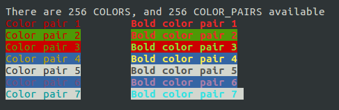

屏幕上的每个字符位置都可以从多种颜色中选择一种作为它的前景色或背景色。例如，你可以在红色背景上写绿色的文本。

`curses` 函数库对颜色的支持有些与众不同，即字符颜色的定义及其背景色的定义并不完全独立。你必须同时定义一个字符的前景色和背景色，我们将它称之为**颜色组合**。

在使用 `curses` 函数库的颜色功能之前，你必须检查当前终端是否支持彩色显示功能，然后对 `curses` 的颜色例程进行初始化。为完成这个任务，你需要使用两个函数：`has_colors` 和 `start_color`：

```c
#include <curses.h>

bool has_colors(void);
int start_colors(void);
```

如果终端支持彩色显示，`has_colors` 函数将返回 `true`。然后，你需要调用 `start_color` 函数，如果该函数成功初始化了颜色显示功能，它将返回 `OK`。

一旦 `start_color` 函数被成功调用，变量 `COLOR_PAIRS` 将被设置为终端所能支持的颜色组合数目的最大值，一般常见的最大值为 64。变量 `COLORS` 定义可用颜色数目的最大值，一般只有 8 种。在内部实现中，每种可用的颜色以一个从 0 到 63 的数字作为其唯一的 `ID`。

在把颜色作为属性使用之前，你必须首先调用 `init_pair` 函数对准备使用的颜色组合进行初始化。对颜色属性的访问是通过 `COLOR_PAIR` 函数来完成的：

```c
#include <curses.h>

int init_pair(short pair_number, short foreground, short background);
int COLOR_PAIR(int pair_number);
int pair_content(short pair_number,short *foreground, short *background);
```

头文件 `curses.h` 通常会定义一些基本颜色，它们的名字以 `COLOR_` 为前缀。另外还有个函数 `pair_content`，它的作用是获取已定义的颜色的组合的信息。

下面的语句将红色前景色绿色背景色定义为一号颜色组合：

```c
init_pair(1, COLOR_RED, COLOR_GREEN);
```

然后，通过调用 `COLOR_PAIR` 函数，将该颜色组合作为属性来访问：

```c
wattron(window_ptr, COLOR_PAIR(1));
```

上面这条语句的作用是把屏幕上后续添加的内容设置为绿色背景上的红色内容。

因为一个 `COLOR_PAIR` 就是一个属性，所以可以把它与其他属性结合起来。在个人电脑上，你通常通过 `按位或` 将 `COLOR_PAIR` 属性和附加属性 `A_BOLD` 相结合来实现高浓度的颜色：

```c
wattron(window_ptr, COLOR_PAIR(1) | A_BOLD);
```

**示例代码 color.c：**

```c
#include <unistd.h>
#include <stdlib.h>
#include <stdio.h>
#include <curses.h>

int main()
{
	int i;
	
	initscr();
	
	if (!has_colors()) {
		endwin();
		fprintf(stderr, "Error - no color support on this terminal\n");
		exit(1);
	}
	
	if (start_color() != OK) {
		endwin();
		fprintf(stderr, "Error - could not initialize colors\n");
		exit(2);
	}
	
	clear();
	mvprintw(5, 5, "There are %d COLORS, and %d COLOR_PAIRS available", COLORS, COLOR_PAIRS);
	refresh();
	
	init_pair(1, COLOR_RED, COLOR_BLACK);
	init_pair(2, COLOR_RED, COLOR_GREEN);
	init_pair(3, COLOR_GREEN, COLOR_RED);
	init_pair(4, COLOR_YELLOW, COLOR_BLUE);
	init_pair(5, COLOR_BLACK, COLOR_WHITE);
	init_pair(6, COLOR_MAGENTA, COLOR_BLUE);
	init_pair(7, COLOR_CYAN, COLOR_WHITE);
	
	for (i = 1; i <= 7; i++) {
		attroff(A_BOLD);
		attrset(COLOR_PAIR(i));
		mvprintw(5 + i, 5, "Color pair %d", i);
		attrset(COLOR_PAIR(i) | A_BOLD);
		mvprintw(5 + i, 25, "Bold color pair %d", i);
		refresh();
		sleep(1);
	}
	
	endwin();
	exit(EXIT_SUCCESS);
}
```

运行效果如下：



`curses` 函数库可通过 `init_color` 函数对颜色进行重新定义：

```c
#include <curses.h>

int init_color(short color_number, short red, short green, short blue);
```

这个函数可以将一个已有的颜色（范围从 0 到 `COLORS`）以新的亮度值重新定义亮度值的范围从 0 到 1000。这有点像为 `GIF` 格式的图片定义颜色值。
