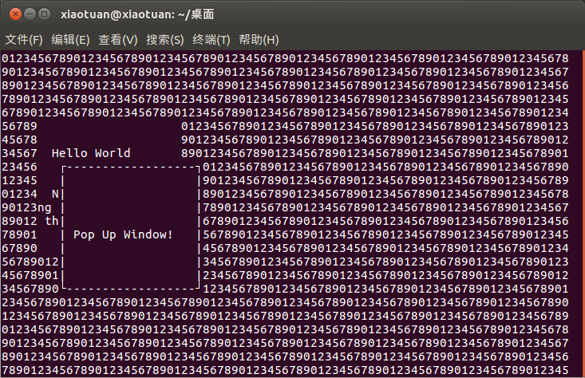

[toc]

### 1. WINDOW 结构

标准屏幕 `stdscr` 只是 `WINDOW` 结构的一个特例，就像标准输出 stdout 是文件流的一个特例一样。`WINDOW` 结构通常定义在头文件 `curses.h` 中，程序应该永远都不要直接访问它，因为该结构在不同的 cusrses 版本中的实现方式不同。

你可以用函数调用 `newwin` 和 `delwin` 来创建和销毁窗口：

```c
#include <curses.h>

WINDOW *newwin(int num_of_lines, int num_of_cols, int sstart_y, int start_x);
int delwin(WINDOW *window_to_delete);
```

`newwin` 函数的作用是创建一个新窗口，该窗口从屏幕位置（ `start_y`，`start_x`）开始，行数和列数分别由参数 `num_of_lines` 和 `num_of_cols` 指定。它返回一个指向新窗口的指针，如果新窗口创建失败则返回 `null`。如果想让新窗口的右下角正好落在屏幕的右下角上，你可以将该函数的行、列参数设为 0。所有的窗口范围都必须在当前屏幕范围之内，如果新窗口的任何部分落在当前屏幕范围之外，则 `newwin` 函数调用将失败。通过 `newwin` 函数创建的新窗口完全独立于所有已存在的窗口。默认情况下，它被放置在任何已有窗口之上，覆盖（但不是改变）它们的内容。

`delwin` 函数的作用是删除一个先前通过 `newwin` 函数创建的窗口。因为调用 `newwin` 函数可能会给新窗口分配内存，所以当不再需要这些窗口时，不要忘记通过 `delwin` 函数将其删除。

> 注意：千万不要尝试删除 `curses` 自己的窗口 `stdscr` 和 `curscr`！

### 2. 通用函数

如果给函数增加了 `w` 前缀，就必须在该函数的参数表的最前面增加一个 `WINDOW` 指针参数。如果给函数增加的是 `mv` 前缀，则需要在函数的参数表的最前面增加两个参数，分别是纵坐标 `y` 和横坐标 `x`，这两个坐标指定了执行操作的位置。坐标值 `y` 和 `x` 是相对于窗口而不是相对于屏幕的，坐标（0, 0）代表窗口的左上角。

如果给函数增加了 `mvw` 前缀，就需要多传递 3 个参数，它们分别是一个 `WINDOW` 指针、`y` 和 `x` 坐标值。

作为一个例子，下面列出了函数 `addch` 和 `printw` 的所有原型定义集：

```c
#include <curses.h>

int addch(const chtype char);
int waddch(WINDOW *window_pointer, const chtype char);
int mvaddch(int y, int x, const chtype char);
int mvwaddch(WINDOW *window_pointer, int y, int x, const chtype char);
int printw(char *format, ...);
int wprintw(WINDOW *window_pointer, char *format, ...);
int mvprintw(int y, int x, char *format, ...);
int mvwprintw(WINDOW *window_pointer, int y, int x, char *format, ...);
```

其他许多函数，例如 `inch`，也有加上诸如 `mv` 和 `w` 前缀的通用函数。

### 3. 移动和更新窗口

通过下面这些函数，你可以移动和重新绘制窗口：

```c
#include <curses.h>

int mvwin(WINDOW *window_to_move, int new_y, int new_x);
int wrefresh(WINDOW *window_ptr);
int wclear(WINDOW *window_ptr);
int werase(WINDOW *window_ptr);
int touchwin(WINDOW *window_ptr);
int scrollock(WINDOW *window_ptr, bool scroll_flag);
int scroll(WINDOW *window_ptr);
```

`mvwin` 函数的作用是在屏幕上移动一个窗口。因为不允许窗口的任何部分超出屏幕范围，所以如果在调用 `mvwin` 函数时，将窗口的某个部分移动到屏幕区域之外，`mvwin` 函数调用将会失败。

`wrefresh`、`wclear` 和 `werases` 函数分别是前面介绍的 `refresh`、`clear` 和 `erases` 函数的通用版本。

`touchwin` 函数非常特殊，它的作用是通知 `curses` 函数库其指针参数指向的窗口内容已发生改变。这就意味着，在下次调用 `wrefresh` 函数时，`curses` 必须重新绘制该窗口，即使用户实际上并未修改该窗口中的内容。

两个 `scroll` 函数控制窗口的卷屏。如果传递给 `scrollok` 函数的是布尔值 `true`（通常是非零值），则允许窗口卷屏。而默认情况下，窗口是不能卷屏的。`scroll` 函数的作用只是把窗口内容上卷一行。一些 `curses` 函数库的实现版本还有函数 `wsctl`，它有一个指定卷行行数的参数，而且该参数还可以指定为负值。

### 4. 实验：管理多窗口

```c
#include <unistd.h>
#include <stdlib.h>
#include <curses.h>

#define LINES 40
#define COLS 80

int main()
{
	WINDOW *new_window_ptr;
	WINDOW *popup_window_ptr;
	
	int x_loop;
	int y_loop;
	char a_letter = 'a';
	
	initscr();
	
	move(5, 5);
	printw("%s", "Testing multiple windows");
	refresh();
	
	for (y_loop = 0; y_loop < LINES - 1; y_loop++)
	{
		for (x_loop = 0; x_loop < COLS - 1; x_loop++)
		{
			mvwaddch(stdscr, y_loop, x_loop, a_letter);
			a_letter++;
			if (a_letter > 'z')
			{
				a_letter = 'a';
			}
		}
	}
	
	/* Update the screen */
	refresh();
	sleep(2);
	
	new_window_ptr = newwin(10, 20, 5, 5);
	mvwprintw(new_window_ptr, 2, 2, "%s", "Hello World");
	mvwprintw(new_window_ptr, 5, 2, "%s", "Notice how very long lines wrap inside the window");
	wrefresh(new_window_ptr);
	sleep(2);
	
	a_letter = '0';
	for (y_loop = 0; y_loop < LINES - 1; y_loop++) 
	{
		for (x_loop = 0; x_loop < COLS - 1; x_loop++)
		{
			mvwaddch(stdscr, y_loop, x_loop, a_letter);
			a_letter++;
			if (a_letter > '9')
			{
				a_letter = '0';
			}
		}
	}
	
	refresh();
	sleep(2);
	
	wrefresh(new_window_ptr);
	sleep(2);
	
	touchwin(new_window_ptr);
	wrefresh(new_window_ptr);
	sleep(2);
	
	popup_window_ptr = newwin(10, 20, 8, 8);
	box(popup_window_ptr, '|', '-');
	mvwprintw(popup_window_ptr, 5, 2, "%s", "Pop Up Window!");
	wrefresh(popup_window_ptr);
	sleep(2);
	
	touchwin(new_window_ptr);
	wrefresh(new_window_ptr);
	sleep(2);
	wclear(new_window_ptr);
	wrefresh(new_window_ptr);
	sleep(2);
	delwin(new_window_ptr);
	touchwin(popup_window_ptr);
	wrefresh(popup_window_ptr);
	sleep(2);
	delwin(popup_window_ptr);
	touchwin(stdscr);
	refresh();
	sleep(2);
	endwin();
	exit(EXIT_SUCCESS);
}
```

运行效果如下：



> 提示：为确保 `curses` 能够以正确的顺序绘制窗口，你必须以正确的顺序对它们进行刷新。其中一个办法就是，将所有窗口的指针存储到一个数组或列表中，你通过这个数组或列表来维护它们应该显示在屏幕上的顺序。

### 5. 优化屏幕刷新

我们的目标是尽量减少需要再屏幕上绘制的字符数目，因为在慢速链路上，屏幕绘制的速度可能会慢得让人难以忍受。`curses` 函数库为此提供了一种特殊手段，这需要用到下面两个函数：`wnoutrefresh` 和 `doupdate`：

```c
#include <curses.h>

int wnoutrefresh(WINDOW *window_ptr);
int doupdate(void);
```

`wnoutrefresh` 函数用于决定把哪些字符发送到屏幕上，但它并不真正地发送这些字符，真正将更新发送到终端的工作由 `doupdate` 函数来完成。如果只是调用 `wnoutrefresh` 函数，然后立刻调用 `doupdate` 函数，则它的效果与直接调用 `wrefresh` 完全一样。但如果想重新绘制多个窗口，你可以为每个窗口分别调用 `wnoutrefresh` 函数（当然要按正确的顺序来操作），然后只需在调用最后一个 `wnoutrefresh` 之后调用一次 `doupdate` 函数即可。这允许 `curses` 依次为每个窗口执行屏幕更新计算工作，最后仅把最终的更新结果输出到屏幕上。
