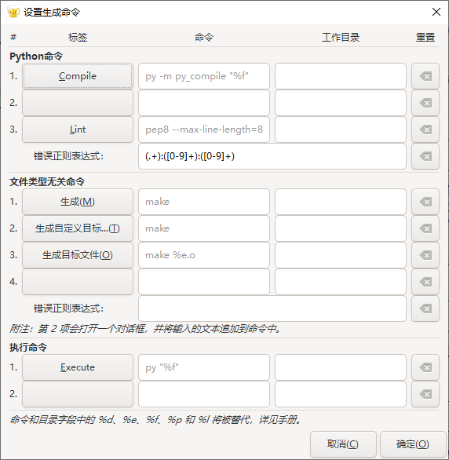

1. 首先打开一个 Python 文件。

2. 选择菜单 `Build（生成）` -> `Set Build Commands（设置生成命令）`，在弹出的 `设置生成命令` 对话框中 `Python 命令` 栏，设置一个标签 `Compile`， 在命令输入框中输入如下命令：

   ```
   py -m py_compile "%f"
   ```

   再设置一个 `Lint` 标签，标签命令内容如下所示：

   ```
   pep8 --max-line-length=8
   ```

   错误正则表达式内如如下所示：

   ```
   (.+):([0-9]+):([0-9]+)
   ```

3. 在 `设置生成命令` 对话框中的 `执行命令` 栏中创建一个 `Execute` 标签，命令内容如下所示：

   ```
   py "%f"
   ```

4. 最终配置如下所示：

   

