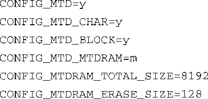
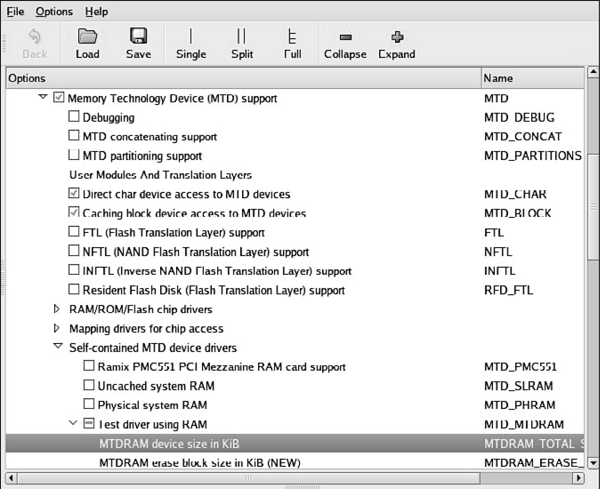

### 10.1.1　开启MTD服务

为了使用MTD服务，内核配置必须开启MTD功能。这同样适用于你的开发工作站和嵌入式系统。为了简单起见，我们将会在一个开发工作站上演示MTD的操作。为了能够跟着我们一块做，你必须在工作站上开启MTD功能。类似地，你也必须开启嵌入式目标板上的MTD功能，这样才能在上面使用它。

MTD有很多内核配置选项，其中有一些还很费解。理解这些繁琐选项的最佳途径就是立刻开始使用它们。为了说明MTD子系统的机制以及它是如何融入到系统中的，我们会从一些简单的例子开始，而你可以在Linux开发工作站上执行这些例子。图10-1显示了开启最少的MTD功能所必需的内核配置（使用命令 `make ARCH=<arch> gcnofig` 打开内核配置界面）。按照图10-1进行选择后，其生成的.config文件中有关MTD的条目显示在代码清单10-1中。你可以在内核配置工具的Device drivers下面找到这些配置选项。

代码清单10-1　基本的MTD配置，来自.config文件

MTD子系统的功能是通过代码清单10-1中的第一条配置选项开启的，你需要选择图10-1中的第一个复选框，即Memory Technology Device (MTD) Support。图10-1中接下来选择的两个配置条目允许我们从用户空间访问MTD设备，比如闪存，而这是一种特殊的设备层的访问。第一个条目（ `CONFIG_MTD_CHAR` ）开启了字符设备模式的访问功能，这实际上是一种串行访问方式，每一次串行读取或写入一字节。第二个条目（ `CONFIG_MTD_BLOCK` ）开启了以块模式访问MTD设备的功能，这是磁盘驱动器所使用的访问方式，一次读取或写入多个块，每个块包含若干字节的数据。这些访问模式允许我们使用熟悉的Linux命令来读写闪存，你很快就会看到。

<b class="my_markdown">图10-1　MTD配置</b>

`CONFIG_MTD_MTDRAM` 配置选项启用了一个特殊的测试驱动程序，它允许我们在开发主机上查看MTD子系统，即使没有实际的MTD设备（比如闪存）也没关系。请记住，在下面这些例子中，我们是在自己的开发工作站上研究MTD，而这是一个让我们熟悉MTD子系统的捷径。你几乎不太可能在一个嵌入式目标板上做这些工作。

这个配置选项还有两个附带的参数，用于设置上述基于RAM的测试驱动：设备大小和擦除块大小。在这个例子中，我们分别指定它们为8192 KB（总大小）和128 KB（擦除块大小）。这个测试驱动的目的是模拟一个闪存设备，主要是为了方便MTD子系统的测试和开发。因为闪存架构使用了固定大小的擦除块，所以这个测试驱动中也包含了擦除块的概念。你很快就会看到如何使用这些参数。

