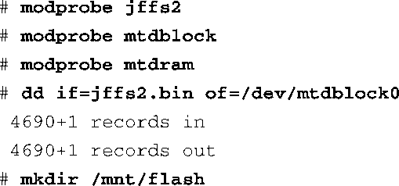
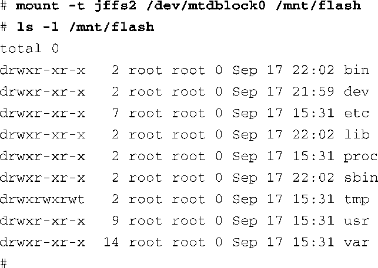

### 10.1.2　MTD基础

最新的Linux内核版本中已经集成了MTD，所以你不需要另外为内核源码打补丁，即可使用MTD功能。如果你需要追随MTD开发的前沿动态，可以从MTD主页上下载最新的源码，本章最后一节列出了其主页的网址。当然，不管是哪种情况，你都必须在内核配置中开启MTD功能，就像图10-1中显示的那样。

开启MTD功能之后，我们就可以研究这个子系统了，看看它是如何在我们的Linux开发工作站上工作的。使用刚刚配置的基于内存的测试驱动，我们可以将一个JFFS2镜像挂载到MTD设备上。假设你已经按照第9章中的内容创建了一个JFFS2镜像，你也许想挂载它并进行查看。我们在第9章中创建的镜像名为 `jffs2.bin` <a class="my_markdown" href="['#anchor101']">[1]</a>。回忆一下第9章的内容，我们是用下面这条命令创建了 `jffs2.bin` 镜像：

<a class="my_markdown" href="['#ac101']">[1]</a>　通过使用代码清单6-1中的例子，你可以很简单地重新创建一个最小化的文件系统，并在这里的练习中使用它。

Linux内核不支持将一个JFFS2文件系统镜像直接挂载到回环设备上，就像挂载ext2和其他文件系统一样。所以我们必须采用不同的方法。我们可以在Linux开发工作站上使用前面提到的基于RAM的MTD测试驱动。代码清单10-2说明了具体的操作步骤。

代码清单10-2　将JFFS2挂载到一个MTD RAM设备上

在代码清单10-2中，我们首先安装了Linux所需的可加载模块，以支持JFFS2和MTD子系统。之后我们加载了 `mtdblock` 和 `mtdram` 模块。加载了必需的设备驱动程序后，我们使用Linux的 `dd` 命令，将JFFS2文件系统镜像中的内容复制到MTD RAM测试驱动中，而这个驱动使用了 `mtdblock` 设备（/dev/mtdblock0）<a class="my_markdown" href="['#anchor102']">[2]</a>。实际上，我们是使用系统RAM作为存储区域来模拟MTD块设备。

<a class="my_markdown" href="['#ac102']">[2]</a>　在使用modprobe mtdram加载这个模块后，它会在系统中添加一个MTD块设备，也就是这里的/dev/mtdblock0。 ——译者注

当我们将JFFS2文件系统镜像复制到MTD块设备中之后，就可以使用 `mount` 命令来挂载它了，就像代码清单10-2中所显示的一样。在挂载这个MTD伪设备之后，我们可以随意地操作其中的JFFS2文件系统镜像。使用该方法的唯一限制就是我们不能改变镜像的大小。它的大小受两个因素的限制。首先，当我们在内核配置工具中配置这个MTD RAM测试驱动时，将它的大小限制为8 MB（8192 KB）。其次，当我们创建JFFS2镜像时，使用mkfs.jffs2工具固定了镜像的大小。镜像大小是由我们创建它时所指定的目录的内容决定的。请参考第9章的代码清单9-9，回顾一下我们是怎样创建 `jffs2.bin` 镜像的。

当我们使用这个方法查看一个JFFS2文件系统的内容时，认识到这个限制是很重要的。考虑一下我们所做的操作：将一个文件（JFFS2文件系统的二进制镜像）复制到一个内核块设备（/dev/mtdblock0）中。接着，以JFFS2文件系统（-t jffs2）挂载这个内核块设备。完成了这些操作后，我们就可以使用传统的文件系统工具来查看和修改这个文件系统了。比如ls、df、dh、mv、rm和cp等工具都可以查看和修改这个文件系统。然而，不同于回环设备，我们复制的文件和挂载的JFFS2文件系统之间是没有关联的。因此，如果修改文件系统的内容，然后卸载它，我们所做的修改就会丢失。如果你想保存这些修改，则必须将它们复制回一个文件中。一种保存的方法是使用下面的命令：

这条命令会创建一个名为your-modified-fs-image.bin的文件，它的大小和mtdblock0的大小一样，而我们是在内核配置时指定了这个设备的大小。在我们的例子中，它的大小是8 MB。在缺乏合适的JFFS2编辑工具的情况下，这是一种查看和修改JFFS2文件系统的有效途径。更重要的是，虽然我们的开发系统上并没有实际的闪存，但这种方法却能够说明MTD子系统的一些基本概念。现在让我们看一个包含物理闪存设备的硬件。

