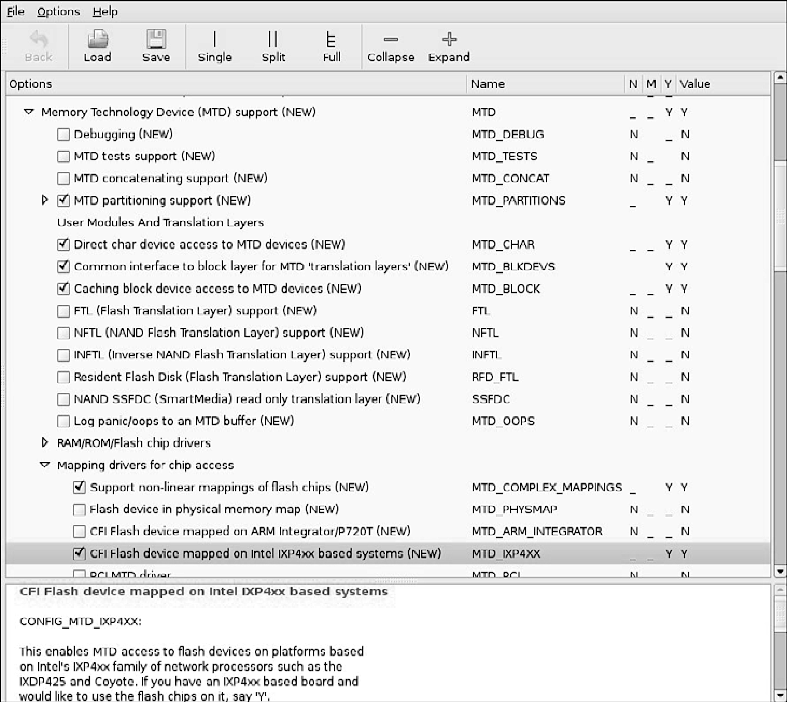

### 10.2　MTD分区

大多数硬件平台上的闪存设备都被划分成几个段，称为分区，类似于传统的（用于桌面工作站的）硬盘驱动器上的分区。MTD子系统支持这样的闪存分区。MTD子系统必须配置为支持MTD分区。图10-2显示了Linux内核配置工具中的相关配置选项。

可以通过几种方法将分区信息传递给Linux内核。你可以在图10-2的 MTD partitioning support下面<a class="my_markdown" href="['#anchor103']">[3]</a>看到对应每个方法的配置选项。目前支持的方法包括以下这几种：

+ 解析Redboot分区表；
+ 在内核命令行中定义分区表；
+ 使用与具体板卡相关的映射驱动；
+ 使用TI AR7的分区支持。

<b class="my_markdown">图10-2　支持MTD分区的内核配置</b>

<a class="my_markdown" href="['#ac103']">[3]</a>　此处有误，图10-2中并没有展开这个选项，不过可以在图10-3中看到。——译者注

MTD也支持不进行分区的配置。在这种情况下，MTD只是将整个闪存看做是一个单独的设备。

