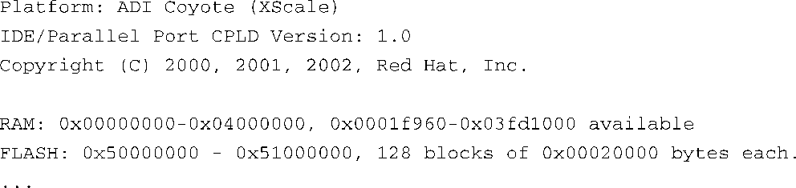
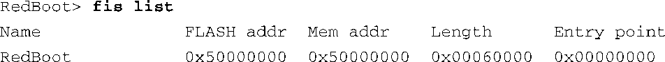
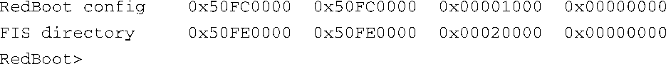
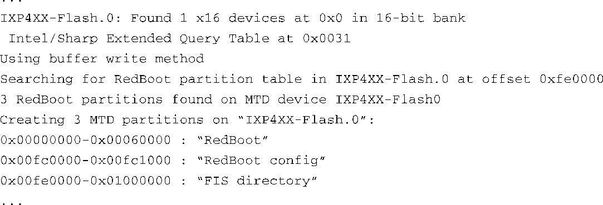
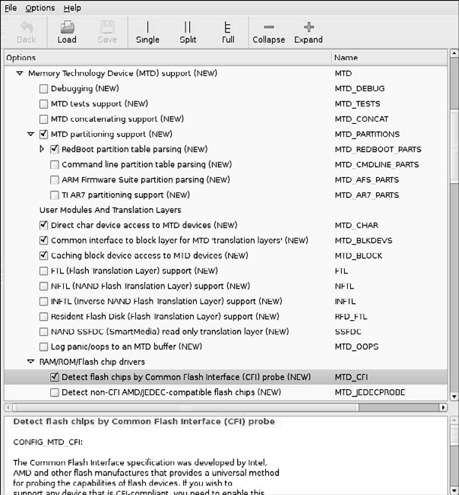
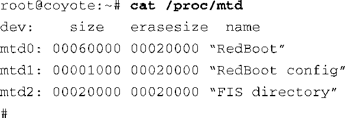
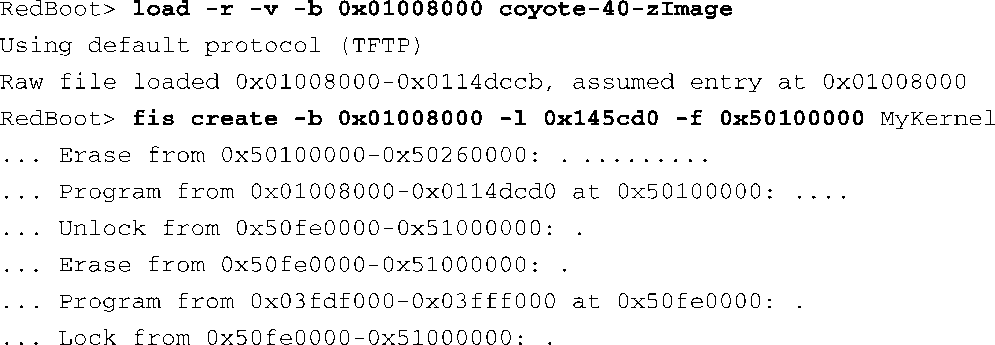
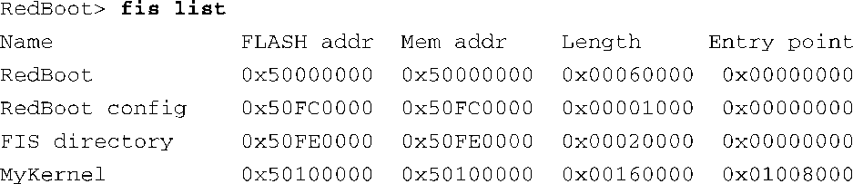
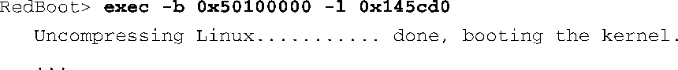

### 10.2.1　使用Redboot分区表进行分区

一种定义和检测MTD分区的常用方法源于以前的一个分区实现方式：Redboot分区。Redboot是很多嵌入式板卡所使用的引导加载程序，特别是那些基于ARM XScale的板卡，比如ADI Engineering公司的Coyote参考平台。

MTD子系统定义了一种在闪存设备上存储分区信息的方法，类似于硬盘驱动器上分区表的概念。在使用Redboot分区的情况下，开发人员在闪存设备上保留和指定一个擦除块，用它来存放分区定义。还需要选择一个映射驱动，它会在系统引导时调用分区解析函数，用于检测闪存设备上的分区。图10-2显示了我们为示例参考板所选的映射驱动。就是最后那个高亮的条目定义了配置选项 `CONFIG_MTD_IXP4XX` 。

和往常一样，仔细地研究一个例子有助于说明这些概念。我们首先看一下Coyote平台上的Redboot引导加载程序所提供的信息。代码清单10-3显示在板卡加电时，Redboot引导加载程序输出的一些信息。

代码清单10-3　系统加电时Redboot输出的消息

以上的控制台输出信息告诉我们：这块板卡上的RAM被映射到从0x00000000开始的物理地址上，闪存（Flash）被映射到从0x50000000到0x51000000的这段物理地址上。我们还可以看到闪存有128个块，每块大小为0x00020000字节（128 KB）。

Redboot包含了一条命令，用于创建和显示存储在闪存上的分区信息。代码清单10-4显示了 `fis list` 命令的输出信息，Redboot引导加载程序提供了一系列闪存镜像系统（Flash Image System）命令，而这条命令是其中的一员。

代码清单10-4　Redboot闪存分区列表

从代码清单10-4中我们可以看到，Coyote参考板在闪存中定义了3个分区。名为RedBoot的分区中包含了可执行的Redboot引导加载程序镜像。名为Redboot config的分区中包含了由引导加载程序维护的配置参数。最后一个名为FIS directory的分区中包含了分区表本身的信息。

正确地配置Linux内核之后，它就能够检测和解析分区表并创建MTD分区了，MTD分区用来代表闪存上的物理分区。代码清单10-5显示了一部分引导消息，这是在前面提到过的ADI Engineering公司的Coyote参考板上引导一个Linux内核时的情况，而且我们已经正确地配置了内核，它支持对Redboot分区的检测。

代码清单10-5　在Linux启动时检测Redboot分区

代码清单10-5中的第一条消息是在检测到闪存芯片时打印的，这是通过公共闪存接口（Common Flash Interface，CFI）驱动来完成的，内核的配置选项 `CONFIG_MTD_CFI` 用于开启这个功能。CFI是一个工业标准方法，用于检测闪存芯片的特征，比如生产厂商、设备类型、总大小和擦除块的大小。本章最后一节列出了CFI规范的网址链接，可以参考一下。

我们前面说过，CFI功能是由内核配置选项 `CONFIG_MTD_CFI` 开启的，在内核配置工具中，先找到顶层菜单Memory Technology Device (MTD)，然后选择RAM/ROM/Flash chip drivers菜单下面的Detect flash chips by Common Flash Interface (CFI) probe就可以了，图10-3显示了这个配置选项的位置。

<b class="my_markdown">图10-3　与MTD CFI相关的内核配置</b>

因为我们也开启了配置选项 `CONFIG_MTD_REDBOOT_PARTS` （参见图10-3），MTD就会检测闪存芯片上的Redboot分区表。同时需要注意的是，枚举芯片时所使用的设备名为IXP4XX-Flash.0。你可以从代码清单10-5中看到，Linux在闪存芯片上检测出了3个分区，这和我们之前在Redboot中使用fis list命令时所枚举的分区是一样的。

当这些基础设施到位以后，Linux内核能够自动检测这3个分区，并创建代表它们的内核数据结构。当内核完成初始化之后，我们还可以使用/proc文件系统中的信息进一步证明这一点，代码清单10-6显示了相关内容。

代码清单10-6　内核中的MTD闪存分区

我们可以轻易地创建一个新的Redboot分区。在这个例子中，我们使用了Redboot的FIS命令，但本书不会详细介绍所有的Redboot命令。你可以参考Reboot的用户文档以获取更多的信息，请看本章最后一节的参考文献。代码清单10-7显示了创建一个新的Redboot分区的具体细节。

代码清单10-7　创建一个新的Redboot分区

首先，加载用于创建新分区的镜像。将这个内核镜像加载到内存地址0x0100800。接着，使用Redboot的 `fis create` 命令来创建一个新的分区。指示Redboot将分区创建在起始地址为0x5010000的闪存区域中。你可以看到具体的创建动作，Redboot首先擦除了这块闪存区域，然后写入内核镜像。最后，Redboot解锁它的目录区域，并且更新FIS目录，在其中添加新的分区信息。代码清单10-8显示了命令 `fis list` 的输出，其中包含了新创建的分区的信息。可以将这里的输出信息和代码清单10-4作个对比。

代码清单10-8　新的Redboot分区列表

当然，当我们引导Linux内核时，它会发现这个新的分区，而且我们可以以合适的方式操作它。你也许已经意识到了这个新分区带来的另一个好处：我们现在可以从闪存中引导内核，而不用每次通过TFTP加载它。下面显示了完成这个功能的Redboot命令。只需将闪存分区的起始地址以及镜像的大小（长度）传递给Redboot的 `exec` 命令就可以了，它会将这个镜像迁移到RAM中。

