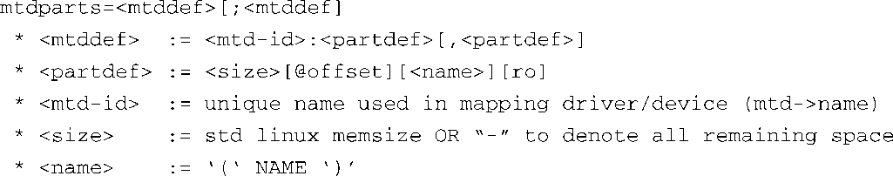

### 10.2.2　使用内核命令行传递分区信息

在10.2节中我们说过，可以使用其他方法将原始的闪存分区信息传递给内核。实际上，最直接的方法（虽然不是最简单的）就是在内核命令行中手工设置分区信息。当然，正如你已经了解到的，对于有些引导加载程序（比如U-Boot）来说，这很容易，但其他一些引导加载程序并不具备在引导时向内核传递命令行的功能。在这些情况下，内核命令行必须在编译期间就配置好，因此修改它们很麻烦，每次修改分区信息后都需要重新编译内核本身。

为了能够在命令行中传递分区信息，必须配置内核的MTD子系统，使它支持这个功能。你可以在图10-2的MTD partitioning support下面<a class="my_markdown" href="['#anchor104']">[4]</a>看到这个配置选项。选择 Command line partition table parsing选项，它定义了 `CONFIG_MTD_CMDLINE_PARTS` 。

<a class="my_markdown" href="['#ac104']">[4]</a>　图10-2中并没有展开这个选项，可以看图10-3。——译者注

代码清单10-9显示了在内核命令行中定义一个分区时所使用的参数格式（来自内核源码文件.../drivers/mtd/cmdlinepart.c）。

代码清单10-9　在内核命令行中定义MTD分区时所使用的参数格式

在内核命令行中传递的每个 `mtddef` 参数定义了一个单独的分区。正如代码清单10-9所示，每个 `mtddef` 定义包含几个部分。你可以指定独特的ID、分区大小以及相对闪存起始位置的偏移量。你还可以为分区指定名字以及可选的只读属性。对照我们在代码清单10-4中定义的Redboot分区，我们可以像下面这样在内核命令行中静态地定义这些分区：

有了这个定义，内核可以相应地创建4个MTD分区，MTD ID为MainFlash，而这些分区的大小及布局与代码清单10-4中显示的内容相匹配。

