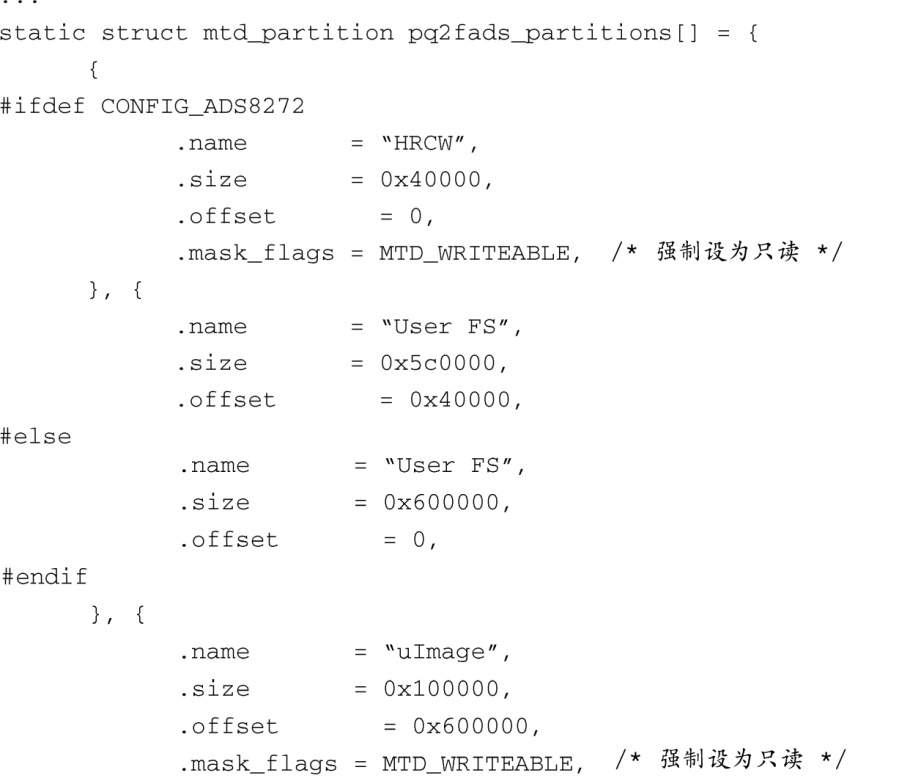
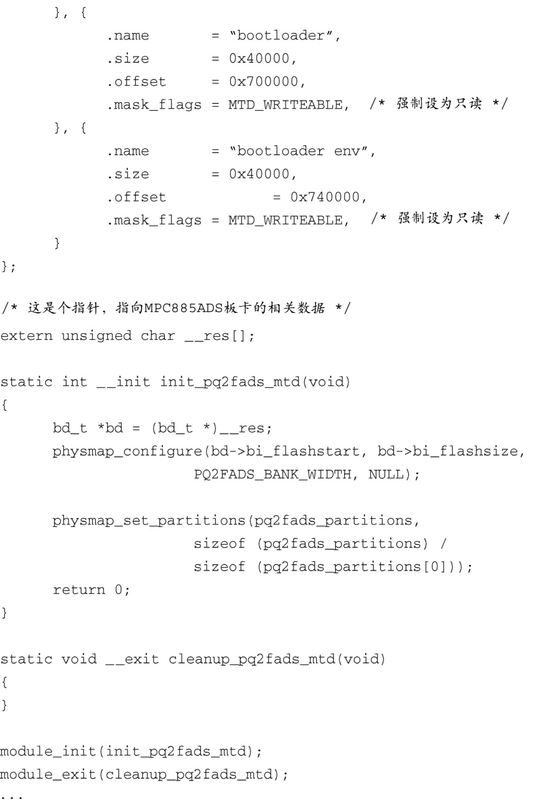

### 10.2.3　映射驱动

如果需要定义与具体板卡相关的闪存布局，你还有最后一个方法，那就是使用针对这个板卡的映射驱动。Linux内核源码树中包含了很多映射驱动的例子，它们位于目录.../drivers/mtd/maps中。其中任何一个都可以供你参考以创建自己的映射驱动。需要注意的是，各个架构的具体实现细节会有所不同。

映射驱动是一个完备的内核模块，其中包含了对 `module_init()` 和 `module_exit()` 的调用，第8章已经有所讲述。一般的映射驱动比较小，也很容易读懂，通常只有几十行的C代码。

代码清单10-10显示了源文件.../drivers/mtd/maps/pq2fads.c中的一部分。这个映射驱动定义了一个飞思卡尔PQ2FADS评估板上的闪存设备，该评估板支持MPC8272等处理器。

代码清单10-10　PQ2FADS 评估板上的闪存映射驱动

这是个简单但完整的Linux设备驱动程序，它将PQ2FADS评估板上的闪存映射情况传递给MTD子系统。回顾一下第8章的内容，如果设备驱动程序中的一个函数是由 `module_init()` 宏声明的，它会在Linux内核引导时<a class="my_markdown" href="['#anchor105']">[5]</a>被自动调用。在PQ2FADS评估板上的这个闪存映射驱动中，其模块初始化函数为 `init_pq2fads_mtd()` ，它只是简单地调用了两个函数：

+ 函数 `physmap_configure()` 向MTD子系统传递了一些闪存芯片的信息，包括它的物理地址、大小、bank宽度以及一个访问它所需的特殊设置函数；
+ 函数 `physmap_set_partitions()` 向MTD子系统传递了这个板卡所特有的分区信息，也就是数组 `pq2fads_partitions[]` 中定义的分区表，该数组是在映射驱动文件开始的地方定义的。

<a class="my_markdown" href="['#ac105']">[5]</a>　此处原文有误，应该是在模块加载时，请参考8.1.6节。——译者注

参照这个简单的例子，你就可以为自己的硬件板卡编写一个映射驱动了。

