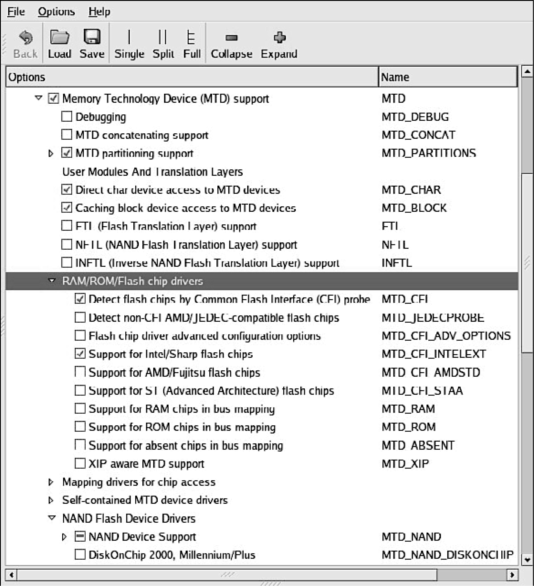

### 10.2.4　闪存芯片驱动

MTD支持很多种类的闪存芯片和设备。你所选的芯片很可能也是MTD支持的。大多数闪存芯片都支持我们在前面提到过的公共闪存接口（CFI）。老一点的闪存芯片可能会支持JEDEC，这是一个较旧的闪存兼容性标准。图10-4显示了一个内核配置界面。从图中可以看出，这个版本的内核支持多种类型的闪存芯片。

<b class="my_markdown">图10-4　内核支持的闪存设备</b>

如果内核不支持你所选的闪存芯片，你就必须自己提供一个设备文件。内核源码目录.../drivers/mtd/chips中有很多例子，你可以选择其中之一作为参考，并以此为基础定制和创建自己的闪存设备驱动程序。除非这个闪存芯片带有某种新奇的接口，可能已经有人编写好它的驱动了，这样的话就更好了。

