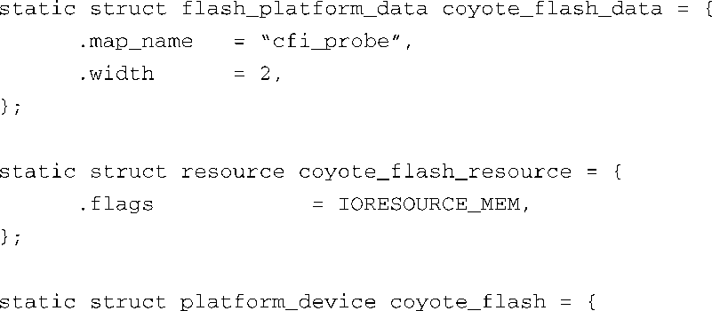
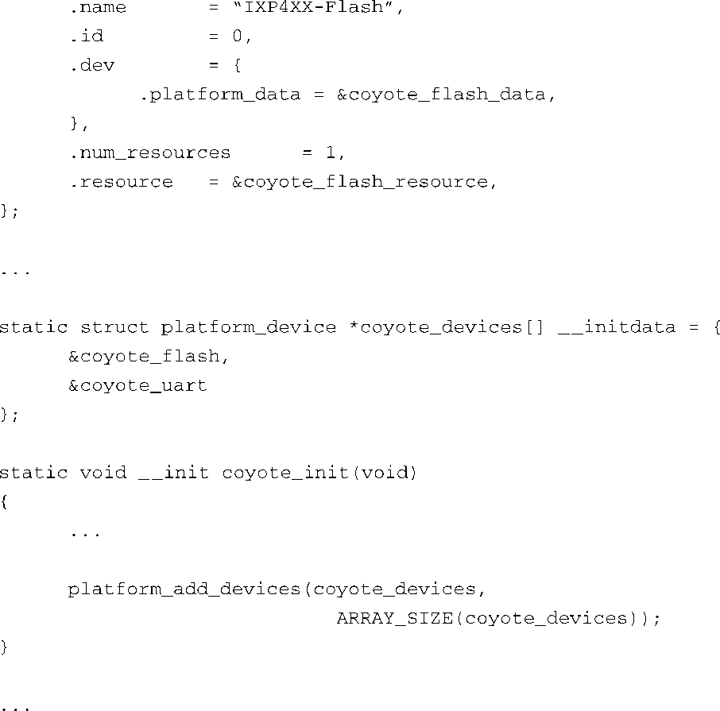

### 10.2.5　与具体板卡相关的初始化

除了映射驱动之外，你还需要在具体板卡（平台）的设置函数中提供一些有关闪存芯片的底层定义，以使MTD闪存系统能够正常工作。代码清单10-11显示了文件.../arch/arm/mach-ixp4xx/ coyote-setup.c中的相关部分。

代码清单10-11　Coyote参考板的具体设置

我们从代码清单10-11的最后面开始看，函数 `coyote_init()` 调用另一个函数 `platform_add_devices()` ，并且在参数中指定了Coyote板上的具体设备，这是在文件前面定义的。你可以看到，就在函数 `coyote_init()` 的上面，数组 `coyote_devices[]` 定义了两个设备。我们这里只讨论其中的 `coyote_flash` 。变量 `coyote_flash` 的类型是 `struct platform_device` ，这个结构体中包含了Linux内核和MTD子系统所需的所有重要细节。

`coyote_flash` 是一个结构体类型的变量，其成员 `.name` 将具体平台的闪存资源和一个具有相同名称的映射驱动绑定到一起。你可以在映射驱动文件.../derivers/mtd/maps/ixp4xx.c中看到这个同名驱动<a class="my_markdown" href="['#anchor106']">[6]</a>。结构体成员 `.resource` 中包含了板卡上闪存的基地址信息。结构体成员 `.dev` （它也是一个结构体，包含了一个成员 `.platform_data` ）将我们的闪存设置和一个芯片驱动联系在一起。在这里，我们指定了板卡使用CFI探测方法，而与之对应的内核配置选项为 `CONFIG_MTD_CFI` 。你可以在图10-4中看到这个配置选择。

<a class="my_markdown" href="['#ac106']">[6]</a>　请参考这个文件中定义的变量 `ixp4xx_flash_driver` 。——译者注

根据自己的架构和板卡，你可以使用类似的方法来定义自己板卡上的闪存资源。

