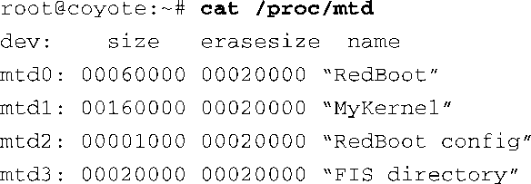
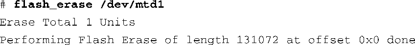
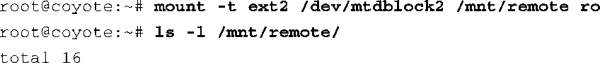
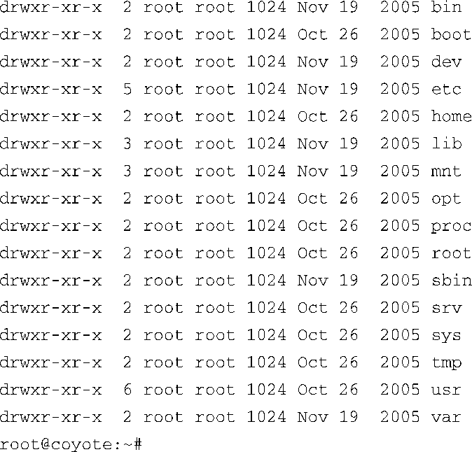
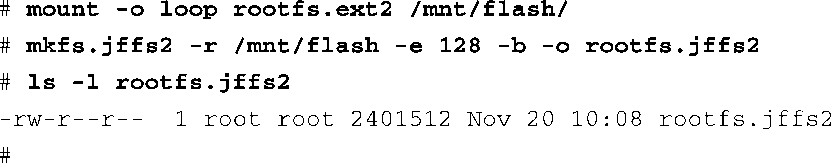
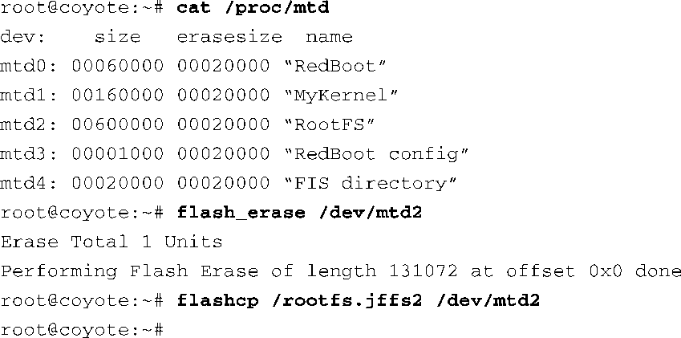
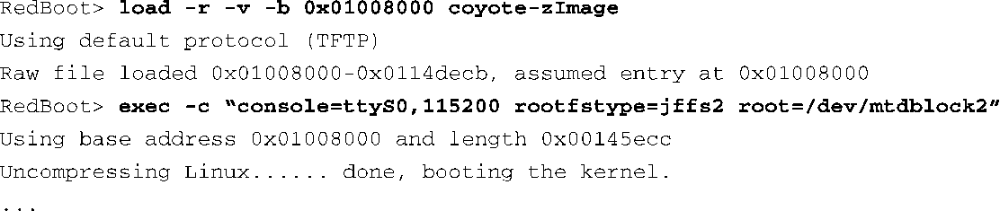

### 10.3　MTD工具

MTD软件包中包含了很多系统工具，可用于设置和管理你的MTD子系统。这些工具是和主要的MTD子系统（应该在Linux内核源码树中构建）分开构建的。它们的构建方式类似于其他采用交叉编译的用户空间应用程序。

使用这些工具必须小心谨慎，因为Linux没有提供任何错误的补救措施。命令中写错一个数字就有可能删除你硬件平台上的整个引导加载程序。这会浪费大量的时间，除非你已经做了备份，并且知道怎样使用JTAG闪存烧写器重新烧写闪存。

和本书其他章节的情况类似，由于篇幅的限制，我们不能在此详细介绍每个MTD工具的使用。我们重点介绍一些最常用的工具，其他的作为练习留给读者。一个最近的MTD软件包中包含了20多个二进制工具。

flash_*系列工具可用于对闪存设备上的MTD分区进行操作。这些工具包括flashcp、flash_erase、flash_info、flash_lock、flash_unlock等。它们的名字都是带有描述性质的，可能你已经猜出了它们的功能了。当闪存上的分区已经定义好，并且内核已经将它们枚举成设备后（内核将每个分区看做是一个设备），我们就可以使用这些用户空间的工具来操作一个分区了。我们再次重申一下前面给出的警告：如果你在一个分区上执行了flash_erase，而该分区包含引导加载程序，那么你将会很荣幸地拥有一个“硅做的镇纸”。如果你执意要这样试验一下，最好先备份你的引导加载程序镜像，并了解如何使用硬件JTAG仿真器或其他闪存烧写工具，以重新烧写闪存。

我们在代码清单10-7中新建了一个分区（MyKernel），而且运行于Coyote参考板上的内核能够识别出它，如代码清单10-12所示。这里，你可以看到我们新创建的分区在内核中表示为内核设备mtd1。

代码清单10-12　内核中的MTD分区列表

使用MTD工具，我们可以在这个新创建的分区上执行一些操作。下面显示了在这个分区上执行 `flash_erase` 命令的结果：

为了将一个新的内核镜像复制到这个分区中，可以使用 `flashcp` 命令：

更有趣的试验是创建一个根文件系统分区。我们可以使用引导加载程序或Linux内核将初始镜像放在一个Redboot定义的闪存分区中。首先，使用Redboot创建一个新的分区，用于存放我们的根文件系统。下面的这条命令在一个名为RootFS的闪存设备上创建一个新的分区，起始物理地址为0x50300000，长度为30<a class="my_markdown" href="['#anchor107']">[7]</a>个块。请记住，在这个闪存芯片上，每个块（一般称为擦除单元）的大小为128 KB。

<a class="my_markdown" href="['#ac107']">[7]</a>　应该是48，也就是16进制的0x30。命令行中指定的长度为0x600000，而每个块的大小为0x20000（128 KB）。 ——译者注

接着，我们引导内核并将根文件系统镜像复制到这个新创建的分区中，前面已经命名它为RootFS。复制操作是由下面这条命令完成的，你需要在目标板的控制台中执行它。注意，这里假设你已经将文件系统镜像放置到一个目标板可以访问的目录中了。我们在本书中已经重复多次了，使用NFS挂载根文件系统非常有利于你的开发工作，可以在这里使用这个方法。

文件系统的大小不定，可以是几兆字节，或最大可以占据整个分区的空间，所以这个命令会花费一些时间。请记住，这个命令涉及将镜像烧写到闪存中。复制完成后，我们可以将该分区挂载为一个文件系统。代码清单10-13显示了这个过程。

代码清单10-13　将MTD闪存分区挂载为一个ext2文件系统

代码清单10-13中有两个重要的细节。首先，注意到我们在 `mount` 命令行中指定了/dev/mtdblock2。这是一个MTD块设备驱动程序，允许我们将MTD分区当作一个块设备来访问。如果指定的是/dev/mtd2，内核则会使用MTD字符设备驱动程序。mtdchar和mtdblock都是伪设备驱动程序，它们提供了访问底层闪存分区的不同方式，基于字节访问或基于块访问。因为 `mount` 命令中需要一个块设备参数，所以必须使用块设备驱动程序。图10-1中显示了启用这些访问方法的相关内核配置选项。内核配置宏分别为 `CONFIG_MTD_CHAR` 和 `CONFIG_MTD_BLOCK` 。

第二个需要注意的细节是，我们在 `mount` 命令行中使用了一个只读（ `ro` ）开关。使用MTD块设备驱动程序（mtdblock）以只读方式挂载闪存中的ext2镜像，这完全可行。但是，mtdblock驱动并不支持将数据写入一个ext2设备中。这是因为ext2对闪存的擦除块概念一无所知。为了能够将数据写入一个基于闪存的文件系统，我们需要使用了解闪存结构的文件系统，比如JFFS2。

### JFFS2根文件系统

创建一个JFFS2文件系统的过程很简单。除了支持压缩以外，JFFS2还支持耗损均衡，这项特性会将写操作分布于设备的各个块中，从而能够延长闪存的寿命。正如我们在第9章中所指出的，闪存的写寿命是有限的。如果你要选择一个基于闪存的文件系统，务必确认它支持耗损均衡这项特性。我们在本书的其他章节中提到过，你不应当经常向闪存设备中写入数据。具体而言，你应该避免那些针对闪存文件系统的需要频繁写操作的进程。特别注意日志程序，比如syslogd。

我们可以在开发工作站上构建一个JFFS2镜像，使用我们在Redboot的RootFS分区中使用的ext2镜像。JFFS2的压缩优势很快就会体现出来。我们在前面RootFS的例子中使用的镜像是一个ext2类型的文件系统。下面的命令列出了这个镜像的详细信息：

现在让我们用（MTD软件包中的）工具mkfs.jffs2将这个文件系统镜像转换成一个JFFS2镜像。代码清单10-14显示了具体的命令和结果。

代码清单10-14　将RootFS转换为JFFS2

首先，通过一个回环设备将ext2文件系统镜像挂载到开发工作站的一个目录上。接着，使用MTD工具mkfs.jffs2来创建一个JFFS2文件系统镜像。命令行中的 `-r` 标志告诉mkfs.jffs2从何处读取根文件系统镜像的内容。 `-e` 标志告诉mkfs.jffs2构建镜像时所采用的擦除块的大小，这里指定为128 KB，而默认值为64 KB。如果镜像的块大小与闪存设备的块大小不一致，JFFS2将不能发挥其最优性能。最后，列出最终的JFFS2根文件系统镜像的详细信息，从中可以发现，这个镜像的大小减少了超过60%。如果你的闪存有限，这种方法可以极大地减少对闪存资源的占用。

在代码清单10-14的 `mkfs.jffs2` 命令行中，我们还需要注意另一个重要的标志。其中的 `-b` 标志就是 `-big-endian` （大端字节序）的意思。它会指示 `mkfs.jffs2` 创建一个大端字节序的JFFS2闪存镜像，适合采用大端字节序的目标处理器。因为我们的目标板是ADI Engineering公司的Coyote参考板，它采用了英特尔IXP425处理器，工作于大端字节序模式，所以这个标志非常关键。如果你没有在这里指定 `-b` 标志，将会看到，内核在尝试解析JFFS2文件系统超级块中的内容时，会打印出满屏幕的告警，这是因为字节序不同，内核不能理解超级块中的信息<a class="my_markdown" href="['#anchor108']">[8]</a>。你愿意猜一下我是怎么记住这个重要细节的吗？

<a class="my_markdown" href="['#ac108']">[8]</a>　你也可以配置内核，使其能够识别一个字节序有误的MTD文件系统，但这是以降低性能为代价的。在某些情况下（比如多处理器设计中），这会是个有用的特性。

采用和前面例子类似的方式，我们可以使用flashcp工具，将这个镜像复制到Redboot的RootFS闪存分区中。接着，我们就可以使用一个JFFS2根文件系统来引导Linux内核了。代码清单10-15显示了在目标硬件上执行这些命令的具体细节。

代码清单10-15　将JFFS2镜像复制到RootFS分区中

需要注意的一点是，你必须在配置内核时开启它对JFFS2文件系统的支持。执行命令 `make ARCH=<arch> gconfig` 打开内核配置界面，并选择 File Systems、Miscellaneous File Systems下面的JFFS2。另一个有用的建议是，在使用MTD工具时，可以在命令行中指定 `-v` （verbose，详细信息）标志。它会显示出闪存操作过程中的进度更新等有用信息。

我们已经学习过如何使用Redboot的 `exec` 命令来引导一个内核（请参考10.2.1节的最后部分）。代码清单10-16中显示了以root用户加载和引导Linux内核的详细命令，而且这里使用了新的JFFS2文件系统。

代码清单10-16　引导内核时以JFFS2作为根文件系统

