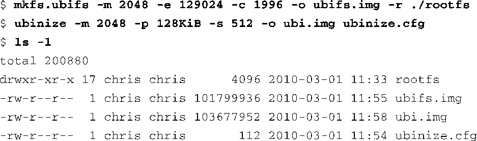
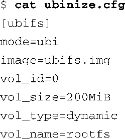
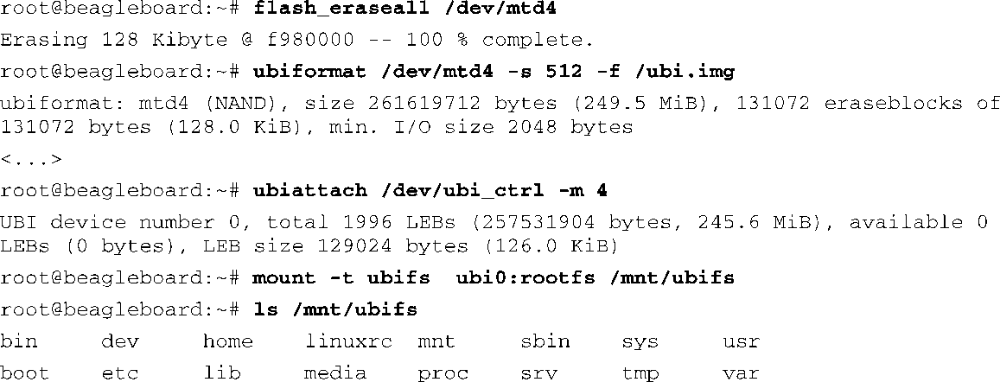

### 10.4.2　构建UBIFS镜像

构建UBIFS镜像要比构建JFFS2镜像复杂一些。这个增加的复杂性来源于NAND闪存技术。构建一个UBIFS镜像需要你对目标系统上的NAND闪存架构有所了解。稍后你就会清楚这一点。你还需要在开发工作站上安装一个较新版本的MTD Utils软件包。可以从以下网址获取MTD Utils：git://git.infradead.org/mtd-utils.git。

代码清单10-17显示了在开发工作站上创建UBIFS镜像的详细过程。在这个例子中，我们假设你已经将期望的文件系统内容放置在名为rootfs的目录中了。

代码清单10-17　构建UBIFS镜像

原始的UBIFS镜像是由工具mkfs.ubifs构建的，它来自mtd-utils软件包。它会生成一个名为ubifs.img的目标文件。在使用命令 `mkfs.ubifs` 时，我们需要将正确的参数传递给它，这很关键。这些参数来源于你的硬件设计和NAND闪存的架构。命令行中的 `-m` 参数指定了最小的I/O单元大小——这里是2 KB。 `-e` 参数指定了这个镜像的逻辑擦除块（Logical Erase Block，LEB）的大小。 `-c` 参数指定了该镜像包含的最大LEB数量。输出镜像的名称是由 `-o` 参数指定的。在这个例子中，我们将它命名为ubifs.img。

现在我们有了一个原始的UBIFS镜像，我们必须生成一个UBI卷镜像（volume image）。使用ubinize工具（mtd-utils软件包的一部分）来完成这项工作。再次强调，我们必须使用针对目标环境的正确参数。此外，你还会发现ubinize需要一个配置文件。配置文件ubinize.cfg中包含了卷名（volume name）等信息，我们一会儿就会看到。

我们在代码清单10-17的 `ubinize` 命令行中指定了最小的I/O大小为2 KB，这和mkfs.ubifs的情况一样。我们还使用 `-p` 参数指定了物理擦除块的大小。在这个例子中，我们使用了物理擦除块大小为128 KiB的NAND闪存。 `-s` 参数指定了子页面的大小，这代表最小的I/O单元。我们将目标输出文件命名为-o ubi.img。我们会把这个镜像烧写到我们的设备中。

ubinize的配置文件指定了它将要生成的卷的信息。代码清单10-18中显示了一个简单的配置文件，代码清单10-17中的ubinize命令就使用了这个文件。

代码清单10-18　ubinize配置文件

从这个配置文件中你可以看到，我们将这个卷命名为rootfs（ `vol_name=` ），而且指定了原始镜像来自一个名为ubifs.img的文件（ `image=` ）。回顾一下代码清单10-17的内容，这正是由工具mkfs.ubifs所创建的镜像。你可以从ubinize的帮助手册中了解更多有关其配置文件的内容。

一旦有了这个最终的镜像，我们就可以将它烧写到设备中了，我们使用ubiformat命令进行烧写。你不能简单地将原始镜像烧写到设备中，这是因为UBI层所使用的NAND闪存包含了特殊的头部，其中记录了每个物理擦除块的擦除次数以及其他信息，用于耗损均衡。使用ubiformat会保存这些头部（其中记录了错误计数等信息）。代码清单10-19显示了详细的过程。

代码清单10-19　使用UBIFS镜像

这里你可以看到挂载UBIFS文件系统所需的一系列命令。首先，使用flash_eraseall（mtd-utils软件包中的一个工具）擦除了整个闪存设备。在使用这个擦除工具时，考虑一下你的实际需要，因为它不会保存任何的错误计数。这应该是第一次使用时的场景。

接着，我们使用 `ubiformat` 命令将镜像写入NAND闪存中。命令行中的 `-s` 参数指定了子页面的大小，这必须和镜像的子页面大小一致（参见代码清单10-17中的ubinize命令行）， `-f` 参数用于选择镜像文件。这个操作完成之后，我们可以附着（attach）一个UBI设备，这是挂载UBI设备所必需的一个步骤。我们需要在ubiattach命令行中指定UBI控制设备（/dev/ubi_ctrl），并指定附着哪个MTD设备。因为我们是将镜像写入MTD的第4个分区（/dev/mtd4）中，所以我们在ubiattach命令行中使用了参数 `-m 4` 。

这些命令都执行完毕后，我们现在就可以挂载UBIFS镜像了。注意，在代码清单10-19中，我们将配置文件ubinize.cfg中定义的卷名（rootfs）传递给了 `mount` 命令。

