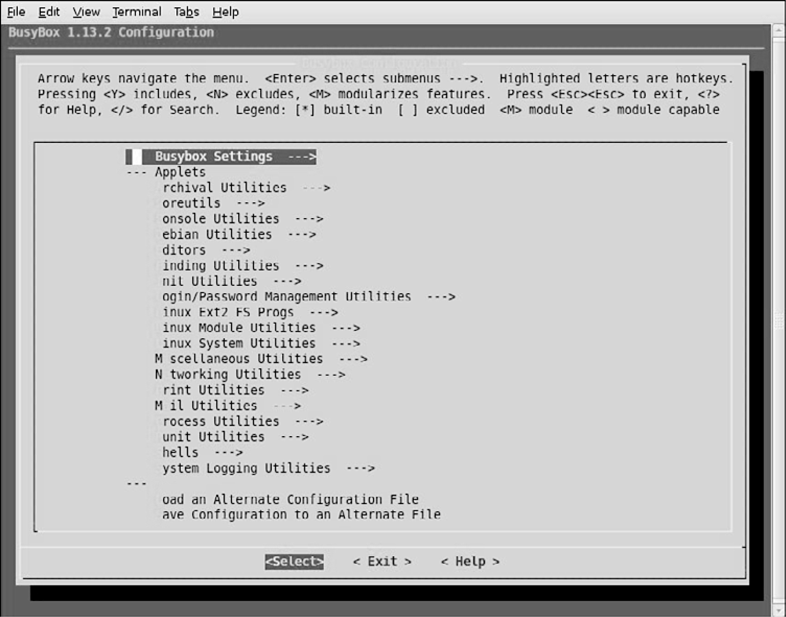
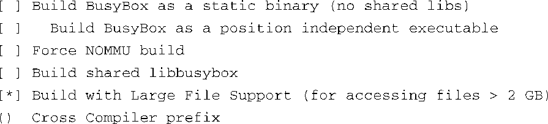
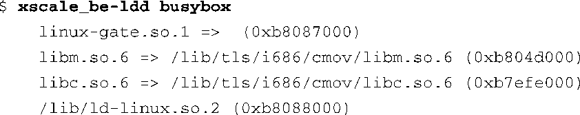

### 11.2　BusyBox的配置

配置BusyBox所使用的命令（ `make menuconfig` ）和配置Linux内核时使用的命令相同，这个命令会启动一个图形化的配置工具，它基于ncurses程序库<a class="my_markdown" href="['#anchor112']">[2]</a>。注意，类似于配置Linux内核时的情况，命令 `make help` 会输出所有可用的make目标以及它们的相关信息，这很有用。配置命令为：

<a class="my_markdown" href="['#ac112']">[2]</a>　ncurses是一个终端图形程序库，详细信息请参考<a href="http://www.gnu.org/software/ncurses/">http://www.gnu.org/software/ncurses/</a>。——译者注

图11-1显示了顶层的BusyBox配置。

<b class="my_markdown">图11-1　顶层BusyBox配置菜单</b>

由于篇幅有限，我们不能逐一介绍每个配置选项。然而，有些选项是值得一提的。一些比较重要的BusyBox配置选项位于Busybox Settings → Build Options下面。你可以在这里找到交叉编译BusyBox应用程序所需的一些配置选项。代码清单11-1详细列出了Build Options下面的选项。从BusyBox配置工具的顶层菜单Busybox Settings中选择Build Options，就可以进入到这个配置界面。

代码清单11-1　BusyBox的构建选项

第一个选项有助于构建非常小型化的嵌入式系统。它允许静态编译和链接BusyBox，这样，目标系统在运行时不需要任何动态加载的程序库（比如libc- `*` ）。如果没有这个选项的话，BusyBox的运行需要依赖很多其他程序库。为了确定BusyBox（或其他任何二进制工具）需要哪些程序库，我们只要简单地在目标系统上执行 `ldd` 命令即可。代码清单11-2显示了 `ldd` 命令的输出，这个 `ldd` 是针对ARM XScale架构进行交叉编译而得到的。

代码清单11-2　BusyBox依赖的程序库

注意，如果按默认配置选项编译BusyBox，则它会需要代码清单11-2中显示的4个共享程序库。如果我们选择将BusyBox编译成一个静态的二进制应用程序， `ldd` 命令只会简单地输出一条消息，告诉我们BusyBox不是一个动态的可执行程序。也就是说，它不需要依赖于任何共享库来解析其外部依赖关系。采用静态链接可以减少对根文件系统空间的总体占用，因为在这种情况下不需要任何共享程序库。然而，构建一个不依赖共享程序库的嵌入式应用程序也并非十全十美，因为这意味着你不能在应用程序中使用熟悉的C程序库函数了。为了让你了解不同编译条件下应用程序大小的区别，我们举个简单的例子，静态编译的BusyBox大约是1.5 MB，而动态编译的BusyBox镜像大约是778 KB<a class="my_markdown" href="['#anchor113']">[3]</a>。

<a class="my_markdown" href="['#ac113']">[3]</a>　这时的BusyBox会依赖其他共享程序库，它们总体的大小会超过静态编译的单个BusyBox的大小。——译者注

### 交叉编译BusyBox

我们在本章开头提过，BusyBox的创始人希望这个软件包应用于交叉开发环境中，所以在这样的环境中构建BusyBox是相当简单的。在早期的BusyBox版本中，我们只需要在构建BusyBox时，选择使用一个交叉编译器对其进行编译，并指定交叉编译器的名称前缀就可以了。但这种方法已经被另一种更标准的方法取代了，也就是设置一个环境变量，这类似于构建其他软件包，比如Linux内核。为了在开发工作站上进行交叉编译，并指定一个交叉编译器，只需要在你的环境中定义 `CORSS_COMPILE` 即可。 `CROSS_COMPILE` 的值的例子包括 `arm5vt_le-` 、 `xscale_be-` 和 `ppc_linux-` 。注意，你还可以在刚才描述的配置工具中指定交叉编译器的名称前缀。我们将在下一章中研究嵌入式开发环境，到时会详细讲解与交叉编译相关的编译器前缀。

