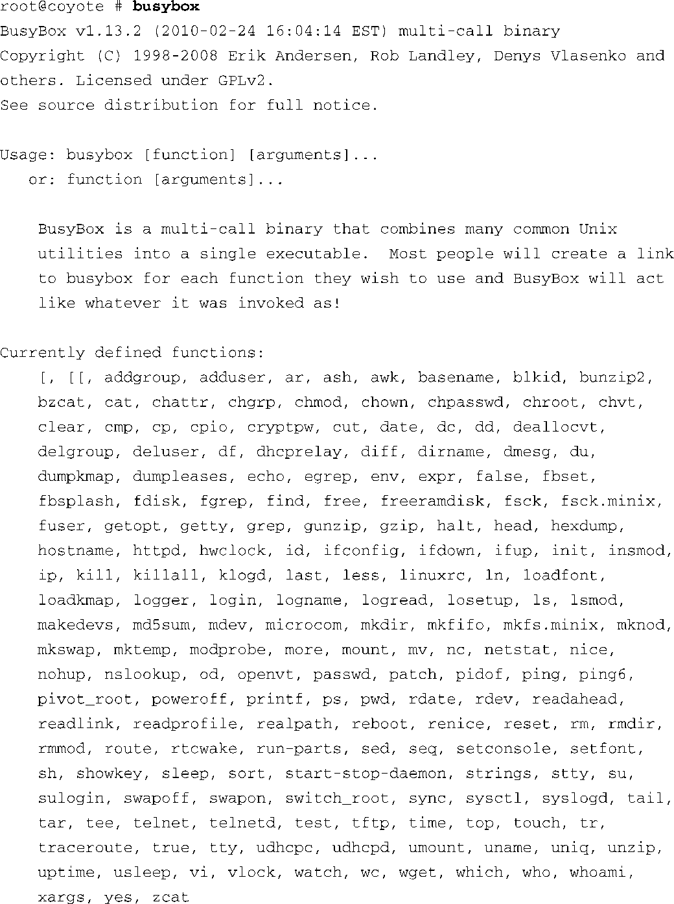
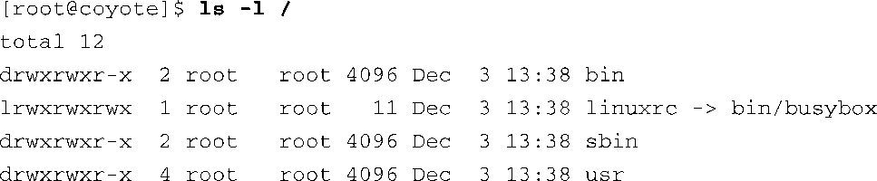
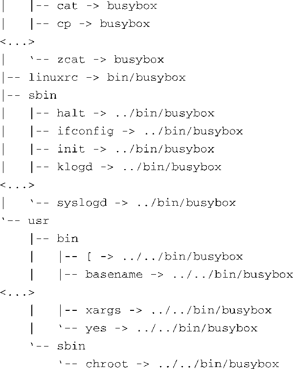

### 11.3　BusyBox的操作

当构建BusyBox时，你最终会获得一个二进制可执行程序，名字为busybox（你应该已经猜到了）。我们可以直接使用这个名称本身来执行BusyBox，但一般通过符号链接（symlink）来调用它。如果在执行BusyBox时没有带任何参数，它会输出所有它支持的功能（命令），这些函数的功能是我们在配置BusyBox时开启的。代码清单11-3显示了一个这样的输出信息（为了适合页面宽度，我们调整了输出格式）。

代码清单11-3　BusyBox的使用

从代码清单11-3中可以看到该BusyBox支持的所有函数。它们是按字母顺序罗列的（忽略脚本运算符[和[[），从 `addgroup` 到 `zcat` ， `zcat` 是一个用于解压压缩文件的工具。该代码清单代表了在构建这个特定BusyBox时所启用的一组工具。

想要执行一个特定的函数，可以在命令行中输入 `busybox` ，之后加上这个函数的名称。例如，为了列出根目录中的所有文件，可以执行以下命令：

在代码清单11-3中显示的BusyBox的使用方法中还包含了另一条重要信息，那就是对这个程序的一个简短描述。它将BusyBox描述为一个支持多调用的二进制可执行程序，将很多常用的工具都集成到了一个单独的可执行程序中。这就是前面提到的符号链接的作用。BusyBox期望以符号链接的形式被执行，而符号链接的名称就是BusyBox要执行的函数的名称。这样的话，在执行一个函数时就不需要输入两个命令名称了（busybox和函数名），用户可以直接使用他们熟悉的命令。看一下代码清单11-4和代码清单11-5，你就会明白了。

代码清单11-4显示了目标设备上的目录结构，这是在busybox源码树中执行 `make install` 命令时由BusyBox软件包生成的。

代码清单11-4　执行 `make install`  时生成的BusyBox符号链接结构

可执行文件busybox位于/bin目录中，而符号链接则分布于目标结构的其他位置，它们都指向/bin/busybox。代码清单11-5展开了代码清单11-4中的目录结构。

代码清单11-5　BusyBox符号链接结构: 详细的树状图

代码清单11-5中显示的输出信息已经被删减了很多，这是为了提高可读性，同时也是为了避免代码清单过长，占用太多篇幅。代码清单中的省略号（...）代表了省略的内容，包含省略号的行只显示给定目录中的前几个和后几个文件。实际上，这些目录中可能会包含100多个符号链接。具体数目取决于你在配置BusyBox时开启的功能。

注意一下BusyBox可执行程序本身，也就是/bin目录中的第2个条目（/bin/busybox）。/bin目录中还包含了很多符号链接，比如 `addgroup` 、 `cat` 、 `cp` 等，一直到 `zcat` ，它们都指向了busybox。再说一下，为了提高可读性， `cp` 和 `zcat` 之间的条目被省略了。有了这个符号链接结构，用户就可以简单地输入工具名并执行其功能了。比如，为了使用BusyBox的ifconfig工具来配置一个网络接口，用户可以输入类似这样的命令：

这条命令会通过 `ifconfig` 符号链接来执行BusyBox应用程序（/bin/busybox）。BusyBox会检查它是怎样被调用的。也就是说，它会读取 `argv[0]` 的内容<a class="my_markdown" href="['#anchor114']">[4]</a>，并以此确定用户请求的具体功能。

<a class="my_markdown" href="['#ac114']">[4]</a>　数组 `argv[]` 是C语言程序中 `main()` 函数的一个入参，其中的每个成员代表了命令行中的各个参数， `argv[0]` 是第1个参数，在这里就是字符串 `ifconfig` 。——译者注

