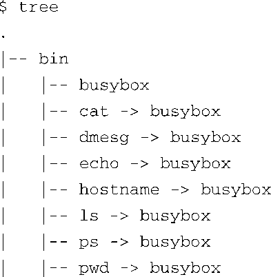
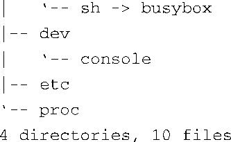
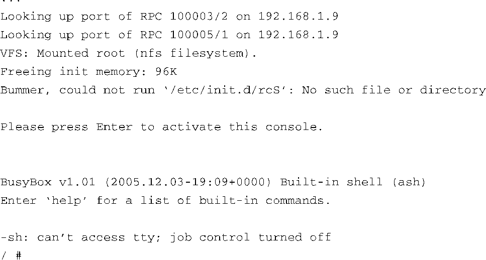

### 11.3.1　BusyBox的 `init` 

请注意代码清单11-5中名为 `init` 的符号链接。在第6章中，我们已经了解了init程序，以及它在系统初始化过程中的作用。回顾一下，内核初始化的最后一个步骤就是尝试执行一个名为/sbin/init的程序。BusyBox没有理由不去模拟init的功能，代码清单11-5中所显示的系统也正是这样配置的。BusyBox实现了init的功能。

BusyBox处理系统初始化的方式不同于标准的System V init。在第6章中我们说过，Linux系统在使用System V（SysV）初始化时需要访问/etc目录下的inittab文件。BusyBox也会读取一个inittab文件，但inittab文件采用的语法格式有所不同。一般而言，如果你正在使用BusyBox，应该不需要使用inittab文件。考虑一下BusyBox的帮助手册中给出的建议：如果你需要运行级别，请使用System V初始化<a class="my_markdown" href="['#anchor115']">[5]</a>。

<a class="my_markdown" href="['#ac115']">[5]</a>　我们在第6章中详细讲述了System V的初始化。

让我们看一下在一个嵌入式系统中的情况。我们已经创建了一个小型的基于BusyBox的根文件系统。将BusyBox配置为静态链接，这样就不需要任何共享程序库了。在代码清单11-6中，我使用 `tree` 命令列出了这个根文件系统的内容。在创建这个小型文件系统时，我们使用了9.11节中介绍的步骤。此处就不复述详细的创建过程了。代码清单11-6列出了这个简单文件系统中的文件。

代码清单11-6　最小化的基于BusyBox的根文件系统

这个基于BusyBox的根文件系统所占用的空间只比busybox本身所需的空间多一点点。在这个配置中，我们使用了静态链接，并支持接近100个工具，而BusyBox可执行程序（/bin/busybox）的大小还不到2 MB：

现在让我们看一下这个系统的运行情况。代码清单11-7显示了这个基于BusyBox的嵌入式系统在加电时的控制台输出信息。

代码清单11-7　BusyBox以默认方式启动

代码清单11-7中的嵌入式参考板被配置为使用NFS挂载其根文件系统。我们在开发工作站使用NFS导出了一个目录，其中包含了代码清单11-6中所列出的简单的文件系统镜像。在系统引导的最后阶段，目标板上的Linux内核会通过NFS挂载一个根文件系统。当内核尝试执行/sbin/init时会失败（我们有意设计成这样），因为我们的文件系统中没有/sbin/init文件。然而，正如我们所看到的，内核还会尝试执行/bin/sh。在我们配置了BusyBox的目标板上，这一步成功了，而且busybox是通过根文件系统中的符号链接 `/bin/sh` 启动的。

BusyBox所做的第一件事情就是抱怨它找不到/etc/init.d/rcS文件。这是BusyBox搜索的默认初始化脚本文件。在初始化一个基于BusyBox的嵌入式系统时，这是首选的方法，而不是使用inittab。

当它完成初始化之后，BusyBox会显示一条提示消息，要求用户按回车键，以激活一个控制台。当BusyBox检测到用户按下回车键之后，它会执行一个ash（BusyBox的内置shell）会话，并等待用户输入命令。最后一条有关作业控制（job control）的消息源于以下这个事实：在这个特定的例子中（以及大多数典型嵌入式系统中），我们是在一个串行端口终端创建了系统控制台。然而，Linux内核如果检测到控制台是在一个串行端口终端上，它就会关闭作业控制的功能。

这个例子创建了一个可以正常工作的系统，能够使用大约100个Linux工具，包括核心工具、文件处理工具、网络工具和一个功能还不错的shell程序。可以看到，这个简单的软件包为你提供了一个强大的平台，你可以在上面构建自己的系统应用程序。当然，应当注意的是，这里不支持libc和其他系统程序库，所以在实现应用程序的功能时，你会面临一项艰巨的任务。你必须提供一个典型C程序所需的库函数，包括所有常用的标准C程序库函数和其他库函数。或者，你可以静态链接应用程序及其依赖的程序库，但是，如果你有很多应用程序都采用了这种方法，这些应用程序所占用的总的空间就会很大，很可能会超过动态链接时应用程序和共享程序库共同占用的空间（这时，目标板上既有应用程序也有共享库）。

