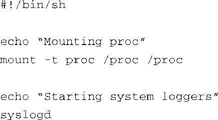
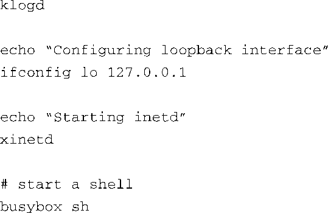

### 11.3.2　rcS初始化脚本示例

在BusyBox生成一个交互式shell之前，它会尝试执行一些定义在/etc/init.d/rcS中的命令，正如代码清单11-7所示。在一个BusyBox系统中，你的应用程序就是在这个脚本文件中开始其生命旅程的。代码清单11-8显示了一个简单的rcS初始化脚本。

代码清单11-8　一个简单的BusyBox启动脚本rcS

这个脚本简单，意思一目了然。首先，一项重要的工作是挂载/proc文件系统，挂载点是专门为它保留的/proc目录。这是因为很多工具都是从/proc文件系统中获取信息的。我们已经在第9章中详细讲述了这一点。接着，我们尽早地开启了系统日志程序，以捕捉系统启动中出现的问题。在开启系统日志守护程序之后，我们配置了系统的本地回环接口。很多传统的Linux工具都假设系统中存在一个回环接口，如果你的系统支持网络套接字，就应该启用这个接口。在启动shell程序之前，我们做的最后一项工作是启动因特网超级服务器xinetd<a class="my_markdown" href="['#anchor116']">[6]</a>。这个程序在后台运行，负责侦听所有已配置网络接口上收到的网络请求。比如，当我们向目标板发起一个远程登录的会话请求时，xinetd就能拦截这个请求，并生成一个Telnet服务器程序来处理这个会话请求。

<a class="my_markdown" href="['#ac116']">[6]</a>　我们在6.3.2节介绍过一个名为inetd的应用程序，这里的xinetd改进了inetd，是它的继任者。——译者注

除了启动shell，你还可以在这个rcS初始化脚本中启动自己的应用程序。代码清单11-8是一个简单的初始化脚本的例子，运行这个脚本的目标板能够接受远程登录请求，并且会运行一些基本的服务程序，比如系统和内核日志程序（分别是syslogd和klogd）。

