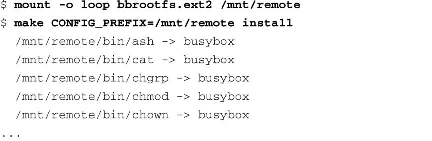
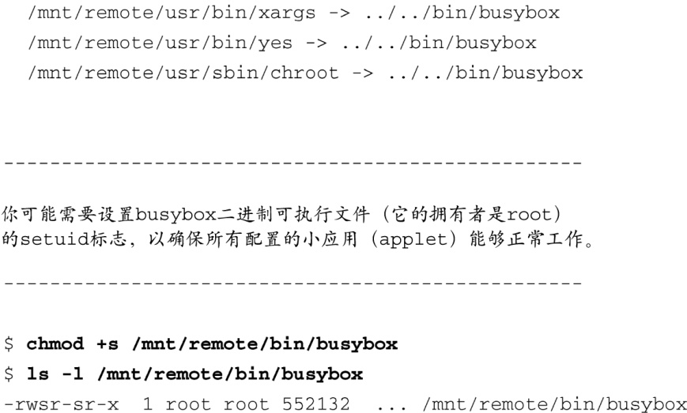

### 11.3.3　BusyBox在目标板上的安装

只有当你理解了符号链接的使用和用途之后，我们才能继续讨论BusyBox的安装事宜。BusyBox的makefile中包含了一个名为install的目标。执行命令 `make install` 会创建一个目录结构，其中包含了BusyBox可执行文件和一个符号链接树。我们需要将这个环境迁移到你的目标嵌入式系统的根目录中，完全包含该符号链接树。我们在前面解释过，有了这个符号链接树之后，我们就不需要在执行一个命令时输入 `busybox command` 了。相反，要列出一个给定目录中的所有文件，用户只需输入 `ls` ，而不用输入 `busybox ls` （这里的 `ls` 是一个指向busybox的符号链接）。如前所述，这个符号链接会执行BusyBox并完成 `ls` 的功能。回顾一下代码清单11-4和代码清单11-5中显示的符号链接树。注意，BusyBox的构建系统只会为那些已开启的功能（通过配置工具选择需要的功能）创建相应的链接。

如果你想在根文件系统中放置所有必需的符号链接，最简单的方法就是让BusyBox的构建系统来帮你完成这项工作。你只需将根文件系统挂载到开发工作站上，并且将 `CONFIG_PREFIX` 传递给BusyBox的makefile。代码清单11-9显示了详细的过程。

代码清单11-9　在根文件系统中安装BusyBox

首先，我们将根文件系统的二进制镜像挂载到一个期望的挂载点上——在这里是/mnt/remote，我经常用的一个挂载点。接着，我们执行了BusyBox的 `make install` 命令，并将 `CONFIG_PREFIX` 传递给它，这个参数指定了符号链接树和BusyBox可执行文件的安装位置。虽然不能从代码清单中明显地看出来，但makefile会调用一个名为applets/install.sh的脚本文件，由它来完成主要的工作。该脚本会遍历一个文件<a class="my_markdown" href="['#anchor117']">[7]</a>，文件中罗列了所有已开启的BusyBox小应用（applet），并在 `CONFIG_PREFIX` 所指定的路径中为它们分别创建一个符号链接。这个脚本很啰嗦，每创建一个符号链接，它就输出一行消息。为了简洁起见，代码清单11-9中只显示了最前面和最后面几条符号链接通告。代码清单中的省略号代表删减的部分。

<a class="my_markdown" href="['#ac117']">[7]</a>　这个文件是busybox.links。——译者注

安装脚本还会显示一条有关setuid的消息，提醒你可能需要设置BusyBox可执行文件（这个文件的拥有者是root用户）的setuid标志<a class="my_markdown" href="['#anchor118']">[8]</a>。这样那些需要root权限的函数能够正常工作了，即使它是由一个非root用户执行的。这不是严格必需的，特别是在嵌入式Linux环境中，因为这时系统中通常只有root用户。如果你在安装时需要这么做，代码清单11-9也列出了所需的命令（ `chmod +s` ）。

<a class="my_markdown" href="['#ac118']">[8]</a>　如果一个可执行文件的setuid标志被置位，那么执行这个文件的用户就可以获得此文件的拥有者（一般是root）的权限，执行完毕后再恢复到原来的权限。——译者注

安装过程完成后，BusyBox可执行文件和符号链接树都被安装到了我们的目标根文件系统中。最终的目录结构与代码清单11-4非常类似。

BusyBox还有一个有用的选项值得注意，借助它，目标系统能够在运行时创建符号链接树。这个选项是在BusyBox的配置工具里开启的，在系统运行时执行BusyBox，并结合选项 `-install` 就可以安装符号链接<a class="my_markdown" href="['#anchor119']">[9]</a>。要想以这种方式进行安装，你的目标系统必须已经挂载了/proc文件系统。

<a class="my_markdown" href="['#ac119']">[9]</a>　具体的配置选项为 `FEATURE_INSTALLER` ，它在配置工具中的位置为Busybox Settings → General Configuration → Support --install [-s] to install applet links at runtime。在目标系统中安装符号链接的命令为 `busybox --install -s` 。——译者注

