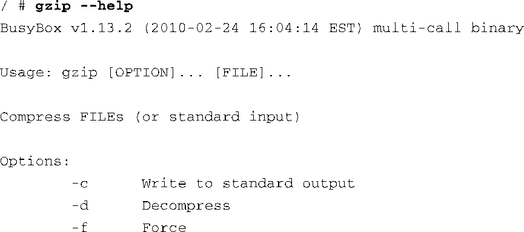

### 11.3.4　BusyBox小应用

最新的BusyBox的帮助手册描述了282个命令（也被称为小应用）。它可以支持相当复杂的shell脚本，包括支持Bash脚本。BusyBox支持 `awk` 和 `sed` ，这是Bash脚本中两个常见的命令。BusyBox还支持一些网络工具，比如ping、ifconfig、traceroute和netstat。有些命令是为了支持脚本而特别加入的，包括 `true` 、 `false` 和 `yes` 。

花点时间阅读一下附录B，这里对每条BusyBox命令作了简略介绍。读完之后，你会更好地了解BusyBox的功能，以及如何将它应用到自己的嵌入式Linux项目中。

我们在本章的开头提到过，与那些桌面Linux发行版中的对应的全能工具相比，很多BusyBox命令只支持有限的特性和选项。一般而言，你可以在执行某个BusyBox命令时带上 `--help` 选项，以获得这个命令的相关帮助信息。这会输出一条消息讲述如何使用这个命令，并简要介绍每个支持的命令选项。举例来说，BusyBox中的gzip小应用只支持有限的选项。代码清单11-10显示了在一个安装了BusyBox的目标系统上执行命令 `gzip --help` 时的输出信息。

代码清单11-10　BusyBox中gzip小应用的使用方法

BusyBox版本的gzip只支持3个命令行选项。而与它对应的全能版本支持超过15个命令行选项。比如，全能的gzip工具支持 `--list` 选项，它能够列出命令行中每个文件的压缩统计数据。然而，BusyBox版本的gzip却不支持这个选项。对于嵌入式系统来说，这一般不会有太大的影响。我们提供了这些信息，为的是你能够在决定是否使用BusyBox时作出明智的选择。如果你需要一个工具的全部功能，解决办法很简单：在BusyBox的配置中去掉对此特定工具的支持，并将标准的Linux工具添加到你的目标系统中。采用这种方法就可以在同一个嵌入式系统中混合使用BusyBox工具和标准Linux工具。

