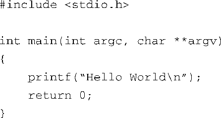
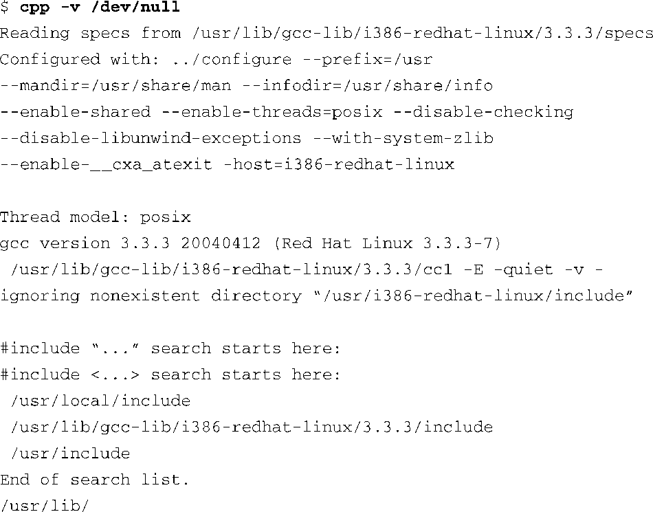
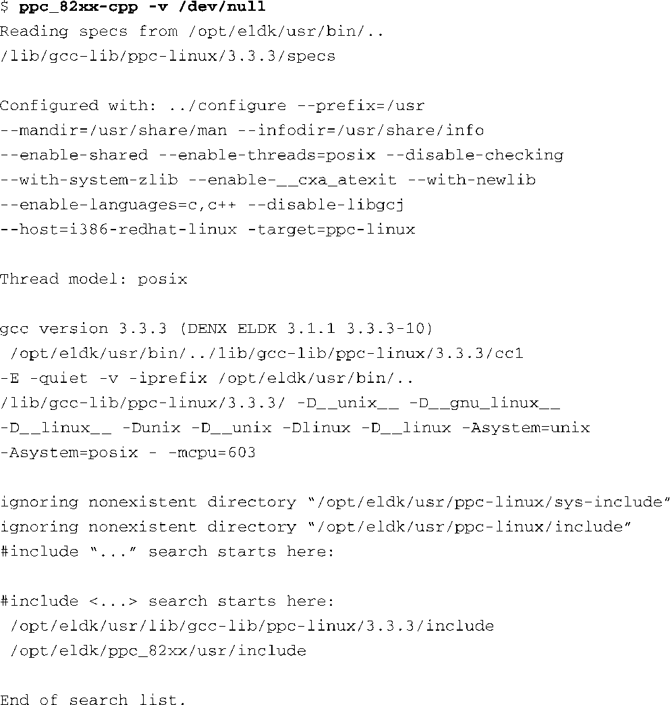

### 12.1　交叉开发环境

对于嵌入式开发的新手来说，有关本地开发环境和交叉开发环境的概念及区别常常让他们感到困惑。实际上，一个系统中通常有3种编译器和3个（或更多）版本的标准头文件（比如stdlib.h）。如果没有合适的工具和主机系统的配合，在目标嵌入式系统上调试应用程序是很困难的。你必须区分哪些文件和工具是在主机系统上运行，哪些是在目标系统上运行的，并对它们分别进行管理。

当我们在这里的上下文中使用主机（host）这个词的时候，我们指的是你桌面上的开发工作站，上面运行着你喜爱的桌面Linux发行版<a class="my_markdown" href="['#anchor121']">[1]</a>。相反，当我们使用目标（target）这个词的时候，我们指的是你的嵌入式硬件平台。因此，本地开发表示的是在主机系统上编译和构建应用程序，而且这个应用程序也运行在主机系统上。交叉开发表示的是在主机系统上编译和构建应用程序，但这个应用程序将运行在嵌入式系统上。将这些定义牢记于心会帮助你更好地掌握本章内容。

<a class="my_markdown" href="['#ac121']">[1]</a>　Webster字典将nonsence定义为“一个古怪或不合常理的想法”。本书作者认为，在一个非Linux/UNIX主机上开发嵌入式Linux平台就属于这种情况。

图12-1显示了一个典型的交叉开发环境的布局。主机PC与目标板之间存在一个或多个物理连接。如果目标板上同时有串行端口和以太网端口的话就最好了，这会给我们的开发带来极大的便利。在本书的后面部分，当我们讨论内核调试时，你会发现，如果开发板上还有另一个串行端口<a class="my_markdown" href="['#anchor122']">[2]</a>，它会是一个有价值的硬件资源。

<b class="my_markdown">图12-1　交叉开发环境设置</b>

<a class="my_markdown" href="['#ac122']">[2]</a>　请参考图14-1。——译者注

在最常见的场景中，开发人员的主机通过一根串行端口线连接到目标板的RS-232串行端口上，然后，开发人员可以在主机上打开一个串行端口终端软件，并通过这根串行端口线与目标板交互。另外，主机和目标板之间还通过以太网连接在一起，这样，开发人员可以在主机上通过Telnet或SSH协议远程登录到开发板上，或者进行远程调试<a class="my_markdown" href="['#anchor123']">[3]</a>。基本思想是利用开发主机的强大功能来运行编译器、调试器、编辑器和其他工具，而目标板只需要执行那些专门为它设计的应用程序。你当然也可以在目标系统上运行编译器和调试器，但我们假设你的主机系统上资源更加丰富，包括处理器能力、RAM、磁盘存储和因特网连接。实际上，很多的嵌入式开发板都没有输入装置供用户输入信息，同时也没有用于输出信息的显示设备。

<a class="my_markdown" href="['#ac123']">[3]</a>　远程调试是基于网络通信的，有关它的详细内容可以参考15.2节。——译者注

### 嵌入式Hello World

一个配置好的交叉开发系统对应用开发人员隐藏了大量的复杂性。看一个简单的例子可以帮助我们揭开和解释其中的奥秘。当我们在主机上编译一个简单的Hello World程序时，工具链（编译器、链接器和相关的工具）对主机和需要编译的程序都做了很多假设。实际上，它们并不是假设，而是编译器引用的一组规则，用以构建出合适的二进制程序。

代码清单12-1显示了一个简单的Hello World程序。

代码清单12-1　又一个Hello World示例

即使是业余开发人员也能看出这个C源文件的一些要点。首先，这个文件调用了函数 `printf()` ，但并未定义该函数。如果你遗漏了 `#include` 指示符（头文件stdio.h中包含了函数 `printf()` 的原型），编译器在编译这个文件时会输出以下常见的信息：

这会引入一些有趣的问题：

+ 文件stdio.h的位置在哪儿，怎样找到它？
+ 函数 `printf()` 的目标代码存放于系统的什么位置？在二进制可执行文件中如何解析这个引用？

不知怎么地，看起来编译器就是知道如何组装出一个合适的二进制文件，并且可以在命令行中执行它。更为复杂的是，最终的可执行文件中还包含了我们从未见过的启动和关闭代码，它们是由链接器自动包含进去的。可执行文件处理了很多细节和琐事，比如向你的程序传递环境变量和参数、启动和关闭时的内务处理、程序退出时的处理，等等。

为了构建Hello World应用程序，我们可以在命令行中执行一个简单的编译器命令，类似于下面这样：

这会生成一个名为hello的二进制可执行文件，而且我们可以直接在命令行中执行它。构建这个应用程序时，编译器会在一些默认的搜索路径中寻找包含的头文件。类似地，为了解析对 `printf()` 函数的引用，链接器也会在一个默认的程序库中寻找此函数的定义。当然，这个程序库就是指标准C程序库。

我们可以在工具链中查询它所使用的默认设置。代码清单12-2中显示了在执行命令 `cpp` ，并传给它 `-v` 标志时的部分输出信息。你也许已经知道了，cpp是指C预处理器（C preprocessor），它是GNU gcc工具链的一个成员。为了提高可读性，我们调整了输出的格式（只是加了若干空白行）。

代码清单12-2　用于本地开发的cpp使用的默认搜索目录

这个简单的查询提供了很多有用信息。首先，我们可以看到编译器是如何被配置的，配置工具是我们熟悉的./configure。默认的线程模型是 `posix` ，如果应用程序使用了线程函数，线程模型决定了应用程序会和哪个线程库链接在一起。最后，你会看到默认的搜索目录，编译器会在这些目录中查找包含的头文件（使用 `#include` 指示符包含的文件）。

如果我们想针对一个不同的架构（比如Power架构）构建hello.c，会是什么情况呢？为采用Power架构的目标板编译应用程序时，我们需要在主机上使用交叉编译器。这时，必须确保这个交叉编译器不会使用本地编译器的默认设置（头文件和程序库的搜索路径）。使用一个配置好的交叉编译器是第一步，拥有一个设计良好的交叉编译环境是第二步。

代码清单12-3显示了一个交叉开发工具链的输出，这是个流行的开源工具链，名称为嵌入式Linux开发工具包（Embedded Linux Development Kit，ELDK），由Denx软件工程公司集成和维护。代码清单中所显示的安装版本是针对Power架构82xx系列处理器而配置的。为了提高可读性，我们在这里加了些空白行。

代码清单12-3　用于交叉开发的cpp所使用的默认搜索目录

这里你可以看到头文件的默认搜索路径已经被调整过了，它们现在指向交叉开发版本的头文件包含目录，而不是本地开发版本的相应目录。这个看似不太重要的细节其实非常关键，它关系到你能否为嵌入式系统开发应用程序和编译开源软件包。这是一个让人感到相当困惑的主题，即使是经验丰富的应用开发人员，在刚刚接触嵌入式系统的时候也会有这种感觉。

