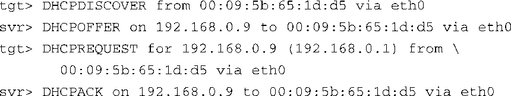
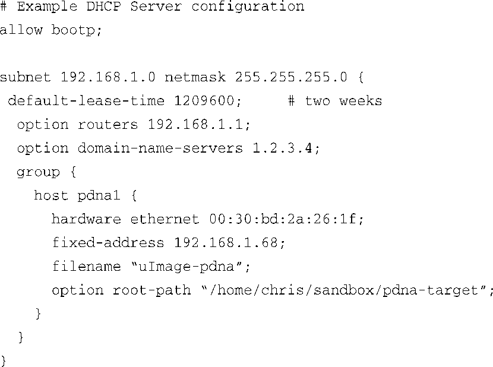

### 12.3.2　BOOTP/DHCP 服务器

在开发主机上运行DHCP服务器能够简化嵌入式目标板的配置和管理。在目标板硬件上包含一个以太网接口是个好主意，我们已经阐明了这样做的原因。当Linux在目标板上启动时，配置以太网接口之后它才能使用这个接口。此外，如果你的目标板使用NFS挂载其根文件系统，Linux需要在引导过程完成之前就配置好目标板的以太网接口。我们在第9章中详细介绍了NFS。

一般而言，系统启动时，Linux可以使用两种方法来初始化以太网/IP接口：

+ 在Linux内核命令行或默认配置中硬编码以太网接口的相关参数，比如采用静态IP配置时可以采用这种方法；
+ 配置内核，让它在系统引导时自动检测网络设置。

显而易见，第二个选择更加灵活。目标板和服务器之间使用DHCP协议或BOOTP协议来完成网络设置的自动检测。如果想了解DHCP协议和BOOTP协议的更多细节，请参考本章最后一节中列出的文献。

DHCP服务器负责为DHCP或BOOTP客户端分配IP地址，我们需要为DHCP服务器配置一个IP子网，它分配的IP地址都来自这个子网，同时，我们还需要配置客户端使用DHCP获取其IP地址。DHCP服务器侦听来自DCHP客户端（比如目标板）的请求，并为它分配地址和其他相关信息，这是目标板引导过程的一部分。代码清单12-5显示了一个典型的DHCP交互，为了查看这个过程，你可以在启动DHCP服务器时加上 `-d` 标志（debug，代表调试），并观察服务器在收到客户端请求时的输出信息。

代码清单12-5　典型的DHCP交互

交互流程是由客户端（目标板）发起的，它首先会发送一个广播帧，其目的是为了发现DHCP服务器。这显示为代码清单12-5中的DHCPDISCOVER消息。服务器响应一条消息（服务器已经配置好，并且已经开启），向客户端提供一个IP地址，这就是上面的DHCPOFFER消息。接着，客户端会在本地测试这个IP地址，并通过这种方式作出响应。这个测试包括发送DHCPREQUEST消息给DHCP服务器，如上所示。最后，服务器会确认对客户端的IP地址分配，这样就完成了目标板的自动配置。

一个有趣的现象是，配置得当的客户端会记住最后一次由DHCP服务器分配的地址。当下一次启动时，它会跳过DHCPDICOVER阶段，直接进入DHCPREQUEST阶段，认为它可以重用之前服务器分配给它的同一个IP地址。Linux内核在引导时不具备这个能力，所以每次它启动时都会发起相同的消息序列。

配置主机上的DHCP服务器并不困难。和往常一样，我们建议你参考一下桌面Linux发行版自带的文档。在一个Red Hat或Fedora发行版中，针对单个目标板的配置条目看起来与代码清单12-6相似。

代码清单12-6　DHCP服务器配置示例

这是个简单的例子，只是为了说明传递给目标板的信息种类。示例中定义了目标板的MAC地址（ `hardware ethernet` ）和分配给它的IP地址（ `fixed-address` ），这两者是一一对应的关系。除了定义它的固定IP地址以外，你还可以传递其他信息给目标板。在这个例子中，我们还将以下信息传递给了目标板：默认路由器（网关）、DNS服务器的地址、所选文件的文件名，以及内核使用NFS挂载根文件系统时的根路径。引导加载程序可以使用这里的文件名从TFTP服务器上下载一个内核镜像。你还可以配置DHCP服务器，让它从一个预定义的范围中分派IP地址，但使用固定地址会方便很多，代码清单12-6显示的就是这种情况。

必须首先在Linux开发工作站上开启DHCP服务器。这一般是通过主菜单或命令行来完成的。参考一下Linux发行版附带的文档，了解适合你的环境的操作细节。例如，要在一个Fedora发行版上开启DHCP服务器，只需以root用户的身份在命令行中输入以下命令：

或者

每次开发工作站开机，你都必须执行一下这个命令，除非将它配置为开机自动启动。参考一下Linux发行版附带的文档，看看怎样进行配置。一般文档中都会列出有关开启服务的内容，或是类似的一些描述。在这个例子中，dhcpd被看做是一个系统服务。

安装DHCP服务器会涉及很多细枝末节，所以，除非你的服务器位于私有网络中，我们建议你在安装服务器之前和系统管理员核对一下。如果你们都处于一个公司局域网中，你很可能会和这个网络本身的DCHP服务发生冲突。

