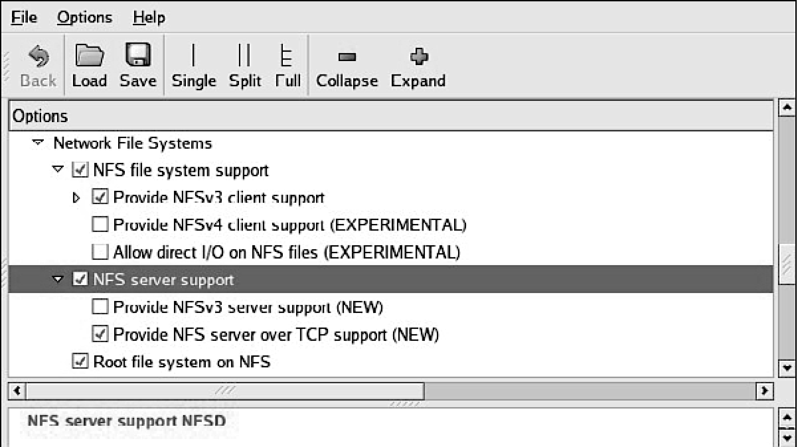
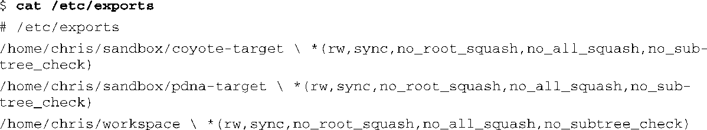

### 12.3.3　NFS服务器[5]

<a class="my_markdown" href="['#ac125']">[5]</a>　我们在9.8节也介绍过NFS，可以一并参考一下。——译者注

使用NFS挂载目标板的根文件系统是一个非常强大的开发手段。这里列出了这种开发方式的一些优点：

+ 根文件系统的大小不会受限于板卡上的有限资源，比如闪存；
+ 在开发过程中，对应用程序文件所做的改动会立刻体现在目标系统中；
+ 你可以在开发调试根文件系统之前调试和引导内核。

设置NFS服务器的具体步骤因桌面Linux发行版的不同而各异。和本章描述的其他服务一样，必须参考Linux发行版所附带的文档，以了解适合你的具体操作细节。NFS服务必须从你的启动脚本、图形化菜单或命令行中启动。例如，在一个安装了Fedora Linux的桌面电脑中，要启动NFS服务，可以以root用户的身份在命令行中执行下面的命令：

或者

注意，在后来的Ubuntu和其他发行版中，这个命令已经变成了/etc/init.d/nfs-kernel-server。

每次启动桌面Linux工作站之后，你都必须执行一下这个命令。（这个服务以及其他一些服务可以在系统开机时自动启动。请参考你的桌面Linux发行版附带的文档。）除了开启这个服务以外，内核必须在编译时就支持NFS。尽管DHCP和TFTP都是用户空间的工具，但是NFS需要有内核的支持。这同样适用于你的开发工作站和目标板。图12-2中显示了内核中有关NFS的配置选项。注意，其中同时包含了支持NFS服务器和NFS客户端的选项。还要注意Root file system on NFS选项。目标板内核必须配置了这个选项才能以NFS挂载其根文件系统。

<b class="my_markdown">图12-2　NFS相关的内核配置</b>

NFS服务器从一个导出文件中获取其指令，这个文件存放在你的开发工作站中，通常是/etc/exports。代码清单12-7显示了这个文件的内容。

代码清单12-7　简单的NFS exports文件

这里显示了3个条目，每个条目中包含了一个目录名称，一个NFS客户端可以远程挂载其中任意一个目录。目录名称后面的星号（ `*` ）表示NFS服务器允许来自任意IP地址的连接请求，后面的括号中设置了挂载相应目录时的属性（读/写， `rw` ）。后一个属性（ `no_root_squash` ）允许具有root权限的客户端能够在给定目录中行使root用户的权利。当客户端是嵌入式系统时，这个属性通常是必需的，因为它们常常只有root账户。

当一个用户发起NFS请求时， `no_all_squash` 属性确保他的uid和gid保持不变，而不是被映射为一个默认的匿名账户。 `no_subtree_check` 属性关闭了服务器上的子树检查。在某些情况下，这可以提升性能和可靠性。如果你想了解这些属性的更多详细信息，请参考NFS服务器的文档和导出文件的帮助手册。

你可以在自己的工作站上测试一下NFS服务器的配置（这时，工作站既是服务器也是客户端）。我们假设你已经开启了NFS服务（需要同时开启NFS服务器和NFS客户端的功能），你可以挂载一个本地的NFS导出目录，就像挂载其他文件系统一样：

如果这个命令能够成功执行，而且你可以通过目录/mnt/remote访问目录.../workspace中的内容，这表明你的NFS服务器配置可以正常工作。

