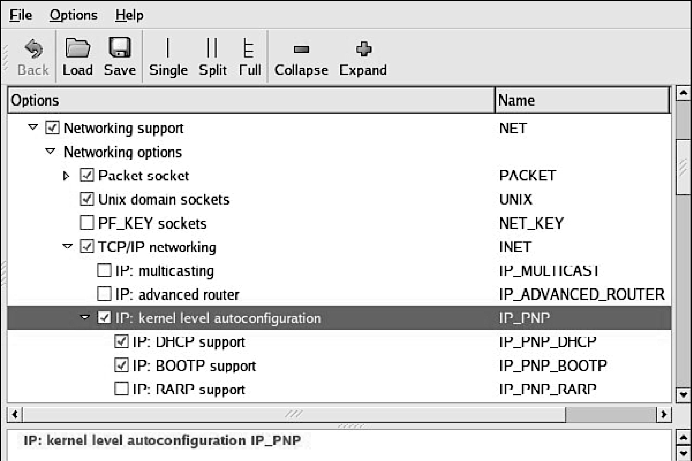

### 12.3.4　目标板使用NFS挂载根文件系统

在目标板上通过NFS挂载根文件系统并不困难，而且，我们在其他地方也提到过，这是个非常有用的开发配置。然而，一些细节必须设置正确，它才能正常工作。下面列出了必需的步骤。

(1) 配置NFS服务器，为目标板导出一个合适的文件系统，其中包含了针对目标架构的文件。

(2) 配置目标板内核，它需要开启NFS客户端的功能以及通过NFS挂载根文件系统的功能。

(3) 开启目标板以太网接口的内核层自动配置功能。

(4) 提供目标板以太网的IP配置，可以使用内核命令行或静态内核配置选项。

(5) 在内核命令行中指定使用NFS挂载根文件系统。

当我们解释NFS服务器配置时，我们在图12-2中显示了相关的内核配置选项。在配置目标板的内核时，你必须确保开启了NFS客户端的功能，而且，特别地，你必须开启通过NFS挂载根文件系统的功能。具体来说，你需要确保内核配置中的 `CONFIG_NFS_FS=y` 和 `CNOFIG_ROOT_NFS=y` 。显然，如果你想在系统引导时通过NFS挂载根文件系统，就不能将NFS配置为可加载模块。

内核层自动配置是一个TCP/IP配置选项，你可以在内核配置工具的Networking选项卡下找到它。你需要在配置目标板的内核时开启 `CONFIG_IP_PNP` 。选择了这个选项后，有几种自动配置的方法可选。选择BOOTP或DHCP，像前面描述的那样。图12-3说明了内核配置选项kernel level autoconfiguration的具体位置。

<b class="my_markdown">图12-3　内核层自动配置</b>

当配置好服务器（开发工作站）和目标板上的内核后，你需要提供目标板以太网接口的配置信息，可以使用我们前面所说的几种方法之一。如果引导加载程序支持内核命令行，那就最简单不过了。支持NFS挂载根文件系统的内核命令行看上去会像是下面这样：

