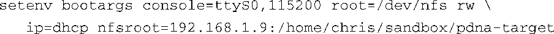
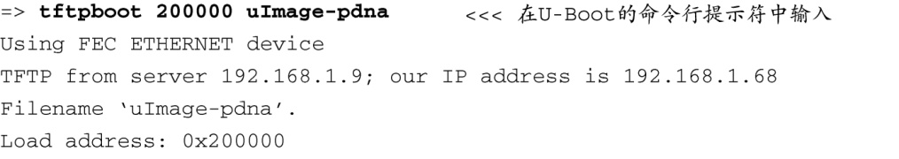
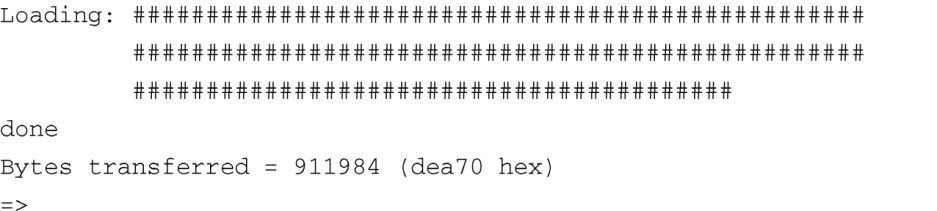
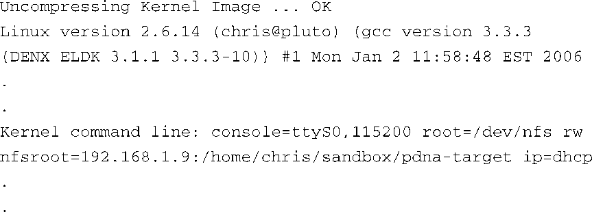
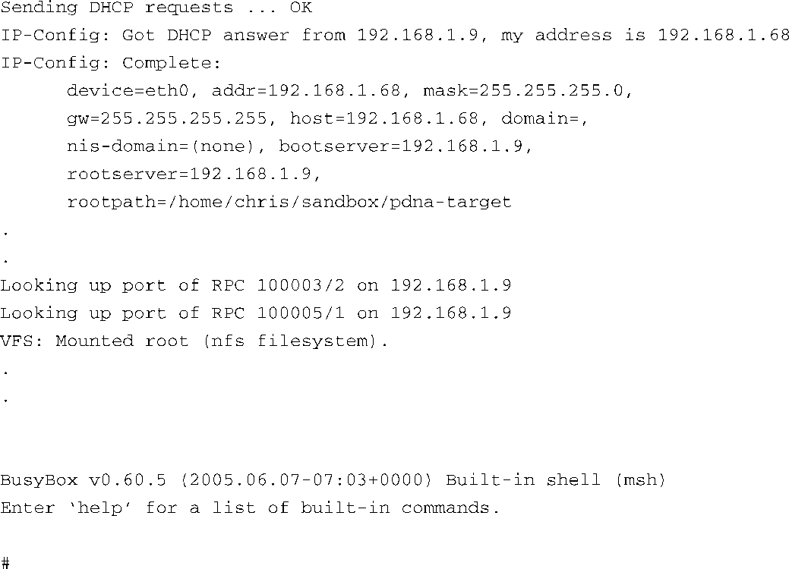
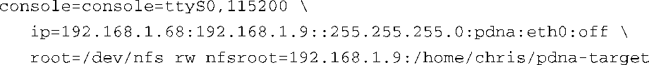

### 12.3.5　U-Boot中使用NFS挂载根文件系统的例子

U-Boot是一个很好的引导加载程序，它支持可配置的内核命令行。使用U-Boot的环境变量（这些变量放置在非易失性存储介质中），我们可以将内核命令行存放于一个专门的参数（ `bootargs` ）中。要在U-Boot中使用NFS挂载根文件系统，使用下面这个命令行（在串行端口终端中输入，所有参数都在一行上）：

接着，使用TFTP服务器加载内核。代码清单12-8显示了在一个采用Power架构的目标板上加载内核时的情况。

代码清单12-8　使用TFTP服务器加载内核

当我们引导内核时，我们可以看到，目标板确实使用了NFS挂载其根文件系统。代码清单12-9显示了内核引导时的一部分输出信息，可以说明这一点。我们调整了输出信息的格式（省略了很多行，并加了一些空白行）以提高可读性。

代码清单12-9　引导时使用NFS挂载根文件系统

在代码清单12-9中，我们首先看到了内核的标题信息，接着是内核命令行。我们在这个命令行中指定了4个参数：

+ 控制台设备（/dev/console）；
+ 根文件系统设备（/dev/nfs）；
+ NFS根路径（/home/chris/sandbox/pdna-target）；
+ IP内核层自动配置方法（dhcp）。

之后不久，内核尝试通过DHCP完成内核层自动配置。该过程开始于 Sending DHCP requests控制台消息。当服务器作出响应，并且完成DCHP交互之后，内核在后面几行中打印出它检测到的配置信息。从中你可以看到DHCP服务器分配给目标板的IP地址为192.168.1.68。不妨比较一下这里通过自动配置获取到的设置信息和代码清单12-6中的DHCP服务器配置。你可以使用类似的服务器配置，为目标板分配IP地址和NFS根路径。

当内核完成了IP自动配置之后，它就可以使用之前获取的参数来挂载根文件系统了。代码清单中的3行打印信息表明了这一点，最后一条消息是由VFS（虚拟文件子系统）打印的，表明它已经挂载了NFS根文件系统。此后，初始化流程按照第5章中所描述的继续进行，直至完成。

也可以将目标板的IP设置以静态方式传递给内核，而不是让内核从DHCP或BOOTP服务器中动态获取这些IP设置。我们可以使用内核命令行直接传递IP设置。在这种情况下，内核命令行看上去会类似于下面这样：

