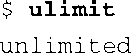
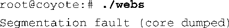
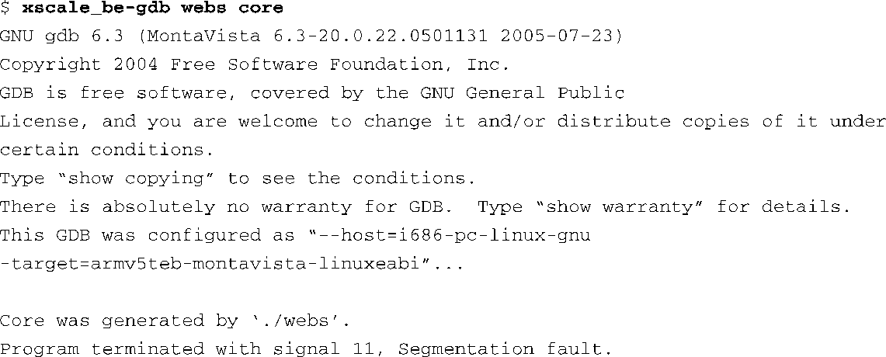
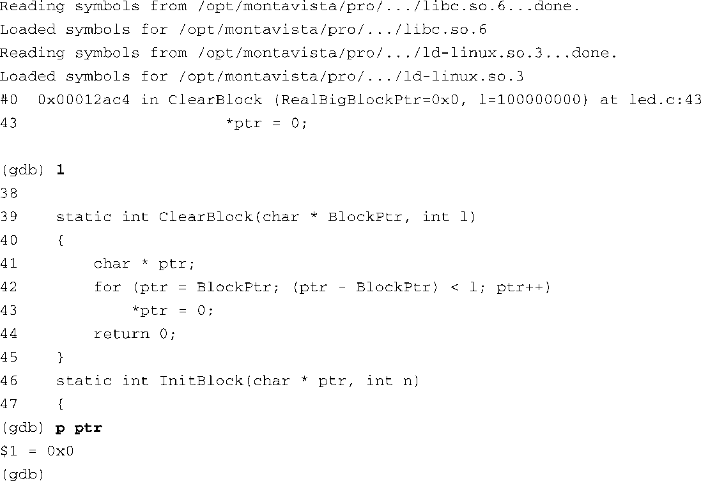

### 13.1.1　调试核心转储

使用GDB的一个最常见的原因是我们想要分析一个核心转储（core dump）。分析过程快速而简单，通常可以很快定位到出错的代码。当一个应用程序产生错误，比如访问了不属于它的内存区域，内核就会生成一个核心转储文件。很多种情况都会导致核心转储的产生<a class="my_markdown" href="['#anchor131']">[1]</a>，但SIGSEGV（段错误）是最常见的一种。SIGSEGV是一个由Linux内核生成的信号，在用户程序非法访问内存时出现。当这个信号产生时，Linux会终止实施非法访问的那些进程。接着，如果进程允许的话，内核会生成一个核心转储镜像。

<a class="my_markdown" href="['#ac131']">[1]</a>　请参考内核源码文件.../include/linux/signal.h中定义的宏 `SIG_KERNEL_COREDUMP_MASK` ，以了解哪些信号会生成core dump。

为了开启生成核心转储的功能，你的进程必须具备相应的权限。这可以通过设置进程的资源限制来实现，使用C函数 `setrlimit()` ，或者是在BASH或BusyBox的shell命令提示符中使用 `ulimit` 。在嵌入式Linux的初始化脚本中常常可以看到以下这条命令，借助它，进程在出错时能够生成核心转储。

这条BASH的内置命令用于设置核心转储的极限值。在前面这个实例中，大小被设置为 `unlimited` 。你可以在shell中执行这条命令，以显示当前的设置：

当应用程序产生了段错误时（比如，它向允许的内存地址范围之外写入数据），Linux会终止这个进程，并且生成一个核心转储（如果进程开启了该功能）。核心转储是运行的进程在产生段错误时的一个快照（snapshot）。

在二进制可执行文件中包含调试符号很有用。如果在构建可执行文件时使用了编译器的调试符号（ `gcc -g` ），生成的文件中就会包含调试符号，GDB在调试它时也会生成更多有用信息。然而，即使我们在构建二进制文件时没有包含调试符号，GDB也有可能会确定那些导致段错误产生的一系列事件。没有调试符号的协助，你可能需要多做一些探索工作。在这种情况下，你必须手动将程序中的虚拟地址与它们在代码中的位置关联起来。

代码清单13-1显示了一个使用GDB分析核心转储的例子。我们稍微调整了一下输出格式，以适合页面宽度。示例软件会有意制造一个段错误。这个程序（名为webs）一运行就会生成一个段错误，下面是输出信息：

代码清单13-1　使用GDB分析核心转储

