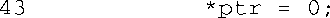
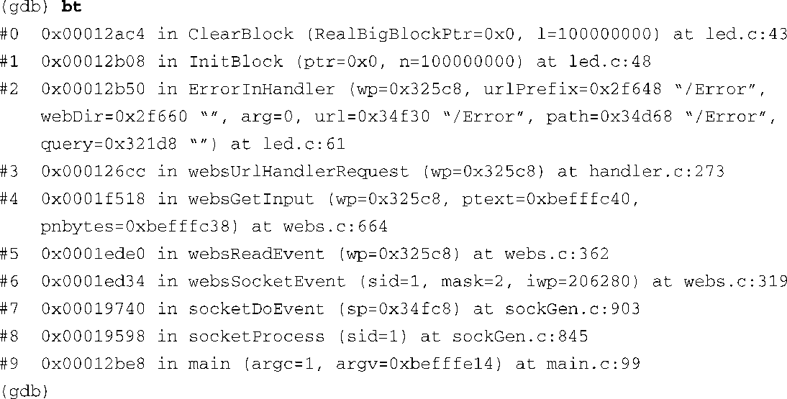
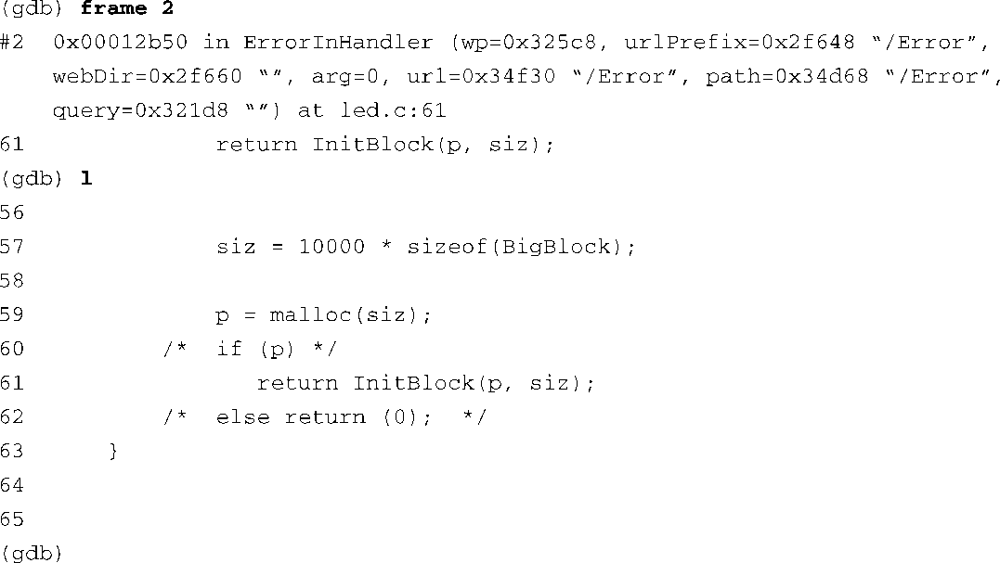

### 13.1.2　执行GDB

代码清单13-1中的第一行显示了怎样在命令行中执行了GDB。因为我们是在进行交叉调试，所以需要一个交叉版本的GDB，而且它是针对我们的主机和目标系统而编译的。执行这个交叉版本的GDB（xscale_be-gdb）时，传递给它两个参数，先是二进制可执行文件的名称，然后是核心转储文件的名称——在这里，就是core。GDB先打印了几行描述配置及其他信息的标题。接着，它显示了进程被终止的原因——signal 11，这表示一个段错误<a class="my_markdown" href="['#anchor132']">[2]</a>。

<a class="my_markdown" href="['#ac132']">[2]</a>　信号以及它们对应的数字是在Linux内核源码树的以下文件中定义的：.../arch/<arch>/include/asm/signal.h。

接下来的几行打印表示GDB加载了这个二进制文件、它依赖的程序库以及核心文件。GDB在启动时打印的最后一行表明了错误发生时程序的当前位置。以字符串 `#0` 开头的那一行代表栈帧（第0个栈帧位于名为 `ClearBlock()` 的函数中，虚拟地址为0x00012ac4）。后面以43开头的一行是指错误代码所在的行，43是行号，位于源文件led.c。从这以后，GDB显示自身的命令行提示符，并等待用户输入。

为了提供一些上下文，我们输入 `gdb list` 命令，这里使用了它的缩写形式 `l` 。当不存在歧义时，GDB能够识别缩写形式的命令。程序错误从这里开始显示。根据GDB对核心转储的分析，下面这行代码就是出错的地方：

接着，我们输入 `gdb print` 命令（缩写为 `p` ）打印变量 `ptr` 的值。从代码清单13-1中可以看到，指针 `ptr` 的值为0。所以，我们可以推断出段错误的原因就是经典的空指针解引用，这是普遍存在于很多编程语言中常见的编程错误。从这里开始，我们可以选择使用回溯追踪（backtrace）命令来查看导致错误发生的函数调用链，帮助定位错误的来源。代码清单13-2显示了命令执行的结果。

代码清单13-2　backtrace命令

backtrace命令显示了函数调用链，向后一直到用户程序的起点—— `main()` 函数。backtrace命令的每行输出都以一个栈帧号开始。使用命令 `gdb frame` 可以切换到任意一个栈帧。代码清单13-3就是这样一个例子。我们在这里切换到2号栈帧，并显示与那个帧对应的源代码。和前面的例子一样，以命令行提示符（ `gdb` ）开头的行表示发送给GDB的命令，而其他行则是GDB的输出。

代码清单13-3　使用GDB在不同的栈帧之间切换

可以看到，有了源代码的帮助（使用 `list` 命令），我们可以很容易追踪到出错的空指针的源头。实际上，只需注意观察我们在这个例子中列出的有关段错误的源码即可。在代码清单13-3中，我们看到，检查函数 `malloc()` 返回值的代码被注释掉了。在这个例子中，函数 `malloc()` 的调用失败造成函数调用链上两个帧之后的空指针操作。虽然这个例子很简单，并且是有意设计的，但使用类似的方法，我们可以非常容易地利用GDB和核心转储追查这类程序崩溃的原因。你也可以通过查看函数调用时的参数值来发现空指针。使用这种方法，你往往能够直接查找出空指针是在哪个栈帧中产生的。

