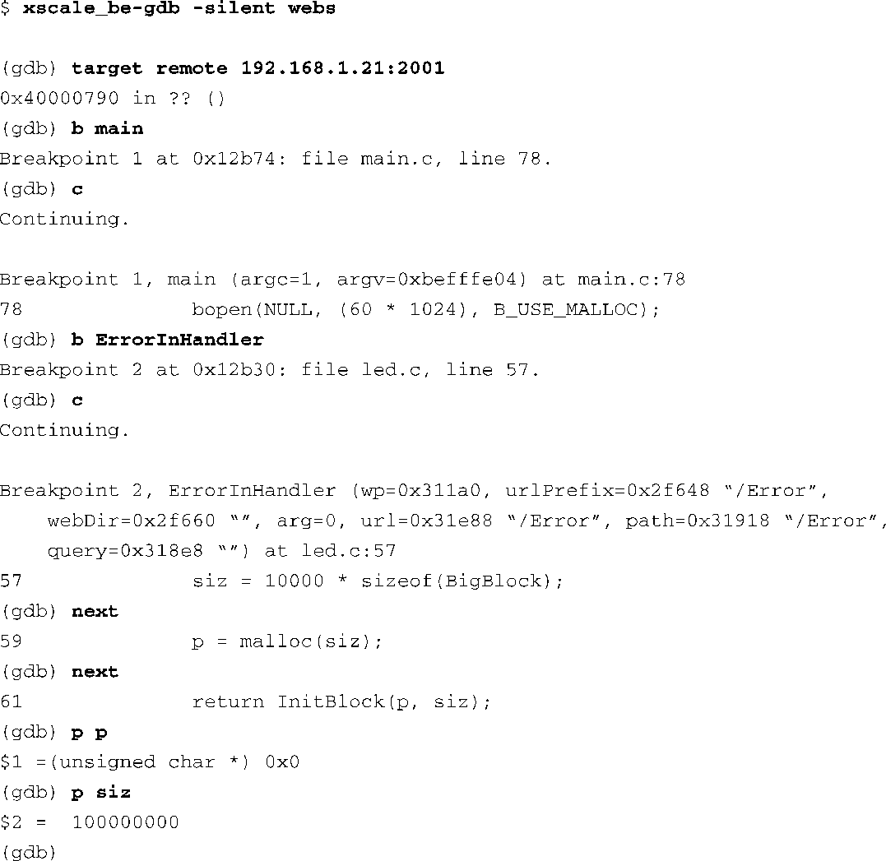

### 13.1.3　GDB中的调试会话

本节会展示一个典型的调试会话（debug sesion），以此结束我们对GDB的介绍。在前面查找程序的崩溃原因时，我们其实可以选择单步调试代码，以定位错误的源头。当然，如果获取了核心转储，从那里开始不会有任何问题。然而，在其他情况下，你也许想设置一些断点，单步调试运行的代码。代码清单13-4中详细显示了我们如何启动GDB，并准备开始一次调试会话。注意，为了使GDB能够发挥作用，在编译程序时，必须在 `gcc` 命令行中开启调试标志（ `-g` ）。不妨参考一下第12章的图12-1，我们在这里进行的是一个交叉调试会话，GDB运行在你的开发主机上，调试一个运行于目标板上的程序。第15章会详细讲述远程应用程序的调试。

代码清单13-4　发起一个GDB调试会话

下面一起看一下这个简单的调试会话，首先使用命令 `gdb target` 连接到目标板上。（第15章会详细讲述远程调试。）建立和目标板的连接后，使用命令 `gdb break` （缩写为 `b` ）在 `main()` 函数的入口处设置一个断点。然后，执行命令 `gdb continue` （缩写为 `c` ），继续程序的执行。如果程序的执行需要参数，我们可以在执行GDB的时候在命令行中输入它们。

我们命中了位于 `main()` 函数的断点，接着设置另一个位于函数 `ErrorInHandler()` 处的断点，并执行 `continue` 命令（还是采用了缩写形式 `c` ）。当命中这个新的断点后，我们开始使用 `next` 命令单步调试代码。在那里我们调用了函数 `malloc()` 。之后，检查它的返回值，并且发现调用失败了，因为它返回了一个空指针。最后，打印了调用 `malloc()` 时传入的参数值，我们看到程序请求了一个非常大的内存（1亿字节），所以失败了。

虽然很简单，但这个GDB示例应该能够让一个新手快速上手了。很少有人能够真正地掌握GDB——它很复杂，功能也很多。13.2节会介绍一个GDB的图形前端，如果你不熟悉GDB，它能够帮助你更轻松地过渡。

关于GDB还有最后一点要注意：毫无疑问，你已经注意到了，当我们第一次在控制台中执行GDB时，它会显示很多标题行，如代码清单13-1所示。我们前面说过，这些例子中使用的是一个交叉版本的GDB，它来自MontaVista公司出品的嵌入式Linux发行版。这些标题行中包含一条嵌入式开发人员必须知道的重要信息：GDB的主机和目标的配置。在代码清单13-1中，当执行GDB时，我们看到了以下的输出信息：

在这个例子中，我们执行的GDB版本运行在一个Linux PC上——具体而言，是一个运行GNU/Linux操作系统的i686处理器。同样关键的是，这个GDB只能用于调试ARM架构的二进制代码，而且这些代码是由armv5teb大端字节序工具链生成的。

嵌入式开发的新手最常犯的一个错误就是在调试目标可执行程序时使用了错误的GDB。如果在调试中出现问题，你应该立刻检查一下GDB的配置，确保它与开发环境匹配。不能使用本地版本的GDB调试目标代码！

