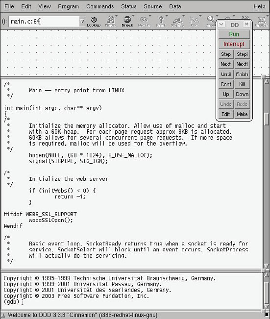
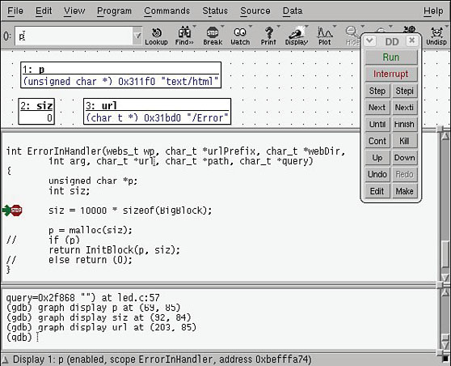

### 13.2　数据显示调试器

数据显示调试器（Data Display Debugger，DDD）是GDB和其他命令行调试器的图形前端，如图13-1所示。除了通过调试会语简单地浏览源代码和单步调试之外，DDD还具有很多高级特性。

我们使用如下方式执行DDD：

假如命令行中没有 `--debugger` 标志，DDD会尝试在你的开发主机上调用本地版本的GDB。如果希望调试一个运行于目标系统上的应用程序，你肯定不想使用本地版本的GDB。DDD命令行中的第2个参数是你要调试的程序。请参考DDD的帮助手册，以了解更多详细信息。

使用图13-1中显示的命令工具<a class="my_markdown" href="['#anchor133']">[3]</a>，就能够单步调试你的程序了。可以以图形化的方式设置断点，或者是使用DDD屏幕下方的GDB控制台窗口。要想调试远程目标板，必须首先使用 `target` 命令将调试器连接至目标系统，就像我们在代码清单13-4中所做的那样。这个命令是在DDD主屏幕下方的GDB窗口中输入并执行的。

<b class="my_markdown">图13-1　数据显示调试器</b>

<a class="my_markdown" href="['#ac133']">[3]</a>　选择View菜单中的Command Tool...就可以显示出这个命令工具。——译者注

当连接上目标板后，可以使用我们之前介绍的类似命令来定位程序的错误。图13-2显示了处于调试会话后期阶段的DDD。

<b class="my_markdown">图13-2　DDD中的调试会话</b>

注意，在图13-2中，我们已经显示了一些重要的程序变量，它们可以帮助定位段错误的产生原因。当我们使用图中显示的命令工具单步调试代码时，可以同步观察这些变量的值。

DDD是GDB的图形前端，功能很强大。它相对容易使用，也支持多种开发主机。请参考本章最后一节的内容，以获取有关GNU DDD的文档。

需要注意的是，随着时间的推移，Eclipse已经掩盖了DDD的光芒，逐渐成为开发人员首选的调试器。由于篇幅关系，我们不能在这里详细介绍Eclipse。本章最后介绍了对Eclipse相关资料，你可以从中了解更多的信息。

