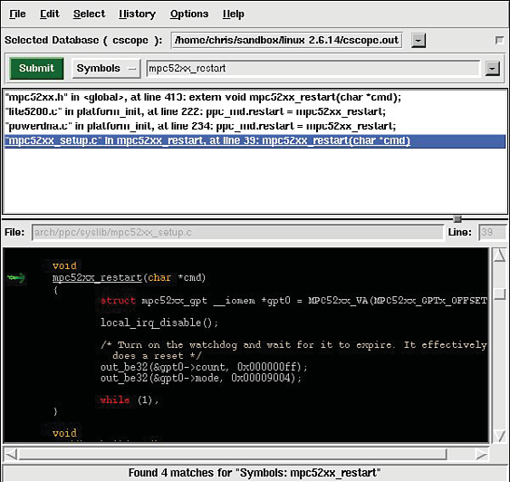

### 13.3　cbrowser/cscope

之所以介绍cbrowser，是因为Linux内核源码树中已经包含了对这个便捷工具的支持。cbrowser是一个简单的源码浏览工具，它能够轻松地浏览大型源码树，并跟踪记录其中的符号。有些发行版，比如Ubuntu，在其软件库中包含了cbrowser，但其他一些发行版，比如最新的Fedora，就没有这么做。在Ubuntu中，只需输入以下命令就可以安装cbrowser：

Linux内核的makefile支持创建cbrowser所使用的数据库。下面就是一个简单的示例，在一个最新的Linux内核版本中执行这条命令：

使用该命令会创建 `cscope` 符号数据库，供cbrowser使用。cscope是引擎，而cbrowser是图形用户界面。如果你愿意，也可以单独使用cscope。它是一个命令行工具，并且非常强大，但是在这个以图形界面为主的时代里，如果需要浏览大型源码树，命令行的方式也许不够迅速和方便。不过，如果vi是你最喜爱的编辑器，cscope可能正适合你！

要在命令行中执行 `cbrowser` ，只需进入包含cscope数据库<a class="my_markdown" href="['#anchor134']">[4]</a>的目录，并输入命令 `cbrowser` 就可以了，不用带任何参数。图13-3中显示了一个会话示例。你可以参考本章最后一节中列出的文献，以了解更多有关这些工具的信息。

<b class="my_markdown">图13-3　运行中的cbrowser</b>

<a class="my_markdown" href="['#ac134']">[4]</a>　cscope数据库是一个文件，名为cscope.out。——译者注

