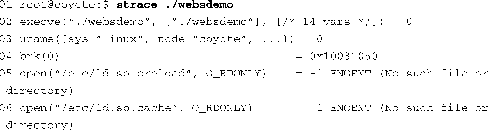
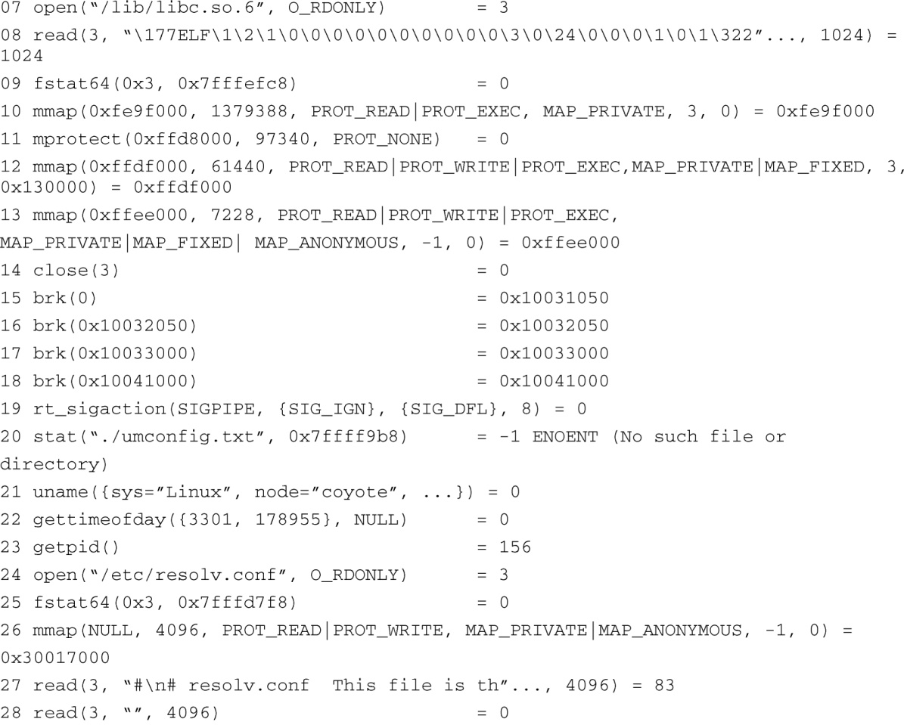
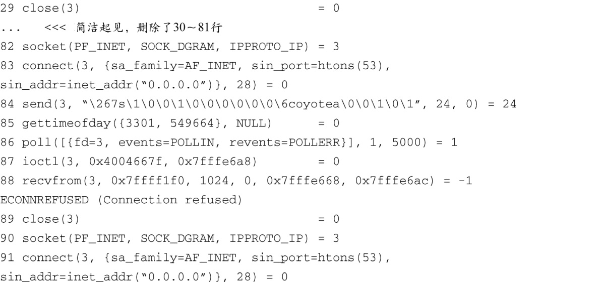
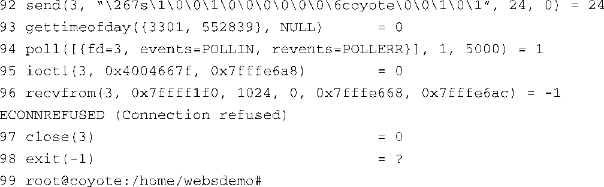

### 13.4.1　strace

strace是一个有用的追踪工具，几乎可以在所有的Linux发行版中找到它。strace能够捕捉一个Linux应用程序所执行的每个内核系统调用，并显示相关信息。strace使用起来特别方便，因为它在追踪一个程序时并不需要程序源码。而且，与使用GDB时的情况不同，被追踪的程序在编译时不一定要包含调试符号。此外，strace也是一个非常富有“洞察力”的教育工具。正如它的帮助手册所说：“新手、编程高手和其他好奇的人们会发现，通过追踪一个程序，即使程序很普通，他也能够了解到有关系统及系统调用的大量信息。”

本章前面讲述过GDB，当我为那一节的内容准备示例程序时，我决定使用一个我不太熟悉的软件项目——一个早期版本的GoAhead嵌入式Web服务器。当我第一次尝试编译和链接这个项目时，我发现有必要使用strace追踪它的运行，这就促成了下面这个有趣的例子。我先是在命令行中执行这个Web服务器程序，但它不声不响地返回到了控制台。没有产生任何错误信息，查看系统日志也没有提供什么线索，但它就是不能运行。

然而，strace却迅速地发现了问题。代码清单13-5中显示了strace在追踪这个应用程序时输出的信息。考虑到篇幅有限，我们已经删除了输出信息中的很多行。未经编辑的输出信息包含了100多行的内容。

代码清单13-5　strace的输出：GoAhead Web Demo

我们在strace生成的输出信息中添加了行号，以增加代码清单的可读性。这个应用程序是在第01行中创建的。如果你想查看一个应用程序，最简单的方法就是直接在它的名称前加上 `strace` 命令。代码清单13-5中的输出信息就是这样生成的。

这个追踪信息中的每一行代表了一个独立的系统调用，它们是由应用程序websdemo向内核发起的。我们不需要分析和理解这里的每一行信息，当然这样做会让你获益良多。我们是在寻找一些异常现象，从而确定程序为什么不能运行。开始的几行是为程序准备执行环境。我们看到了几个 `open()` 系统调用，参数是 `/etc/ld.so.*` ，这表明Linux动态链接加载器（ld.so）正在工作。实际上，第06行为我们提供了一条线索，这个嵌入式开发板并没有配置好。系统中应该存在一个链接器缓存文件（/etc/ld.so.cache），它是由ldconfig生成的（链接器缓存能够显著提高系统搜索共享库引用的速度）。在目标板上运行一下ldcofig就可以解决这个问题<a class="my_markdown" href="['#anchor135']">[5]</a>。

<a class="my_markdown" href="['#ac135']">[5]</a>　可以使用命令 `man ldconfig` 查看一下它的帮助手册，以了解如何为你的目标系统创建一个链接器缓存。

向下一直到第19行都是一些基本的“内务处理”，主要是加载器和libc在执行初始化。注意一下，在第20行中程序尝试寻找一个配置文件，但没有找到。当我们运行这个程序的时候，这可能是个重要的问题。从第24行起，程序开始设置和配置它所需要的合适的网络资源。第24行至第29行打开并读取了一个Linux系统文件，这个文件中包含了DNS服务所需的操作指令，用于解析主机名称。对本地网络的配置一直延续到第81行。这主要包括必要的网络设置和配置，从而为程序本身建立一个联网的基础环境。简洁起见，我们在代码清单中省略了这部分内容。

特别注意一下从第82行开始的网络操作。在这里程序尝试建立一个TCP/IP连接，目标IP地址是全0。方便起见，这里列出第82行的内容：

代码清单13-5中有几点值得关注。我们也许不能够掌握每个系统调用的所有细节，但可以对正在发生的事情有个大致的了解。 `socket()` 系统调用类似于文件系统中的 `open()` 调用。它的返回值（等号右边的3）是一个Linux文件描述符。知道了这一点，我们可以将第82行至第89行的所有操作联系起来，第89行是一个 `close()` 系统调用，它关闭了文件描述符3。

之所以对这组相关的系统调用感兴趣，是因为我们看到了第88行中的错误消息： `Connection refused` 。这时，我们还不知道程序为什么不能执行，但这里看起来有些异常。让我们研究一下。第82行中，系统调用 `socket()` 建立了一个用于IP通信的端点。第83行很奇怪，因为它尝试建立一个到远端端点（套接字）的连接，但远端的IP地址是全0。就算不是网络专家，我们也会产生怀疑，有可能就是它给我们带来了麻烦<a class="my_markdown" href="['#anchor136']">[6]</a>。第83行还提供了另一条重要的线索：端口参数被设置为53。快速在网上搜索一下TCP/IP端口号，我们发现端口53是由域名服务（Domain Name Service，DNS）使用的。

<a class="my_markdown" href="['#ac136']">[6]</a>　有时候在这种环境下全0地址是合适的。然而，我们是在调查程序异常终止的原因，应该对其持怀疑态度。

第84行也提供了一条线索，我们目标板的主机名称是coyote。这也可以从代码清单13-5的第01行中看出来，因为主机名称是命令行提示符的一部分。看起来这是在用DNS查找目标板的主机名称，但是失败了。作为一项试验，我们在目标系统的/etc/hosts文件<a class="my_markdown" href="['#anchor137']">[7]</a>中添加了一个条目，将目标板本地定义的主机名称和板卡本地分配的IP地址关联起来，像下面这样：

<a class="my_markdown" href="['#ac137']">[7]</a>　请使用命令 `man hosts` 看一下它的帮助手册，以了解这个系统管理文件的具体细节。

瞧，我们的程序开始正常运转了。虽然有可能我们没有完全弄清楚为什么这会导致程序的失败（TCP/IP网络方面的专家应该可以），但是 `strace` 命令的输出信息让我们知道了这样一个事实，程序在使用DNS查询目标板的名称时失败了。当我们纠正了错误后，程序可以正常运行，并且开始提供网页服务。简要重述一下，我们没有这个程序的源码可以参考，并且这个二进制镜像在编译时也没有包含调试符号。然而，使用strace，我们却能够确定程序失败的原因，并且实施了一个解决方案。

