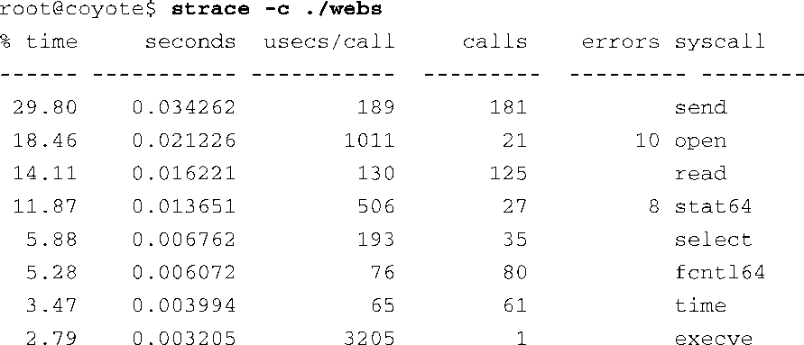
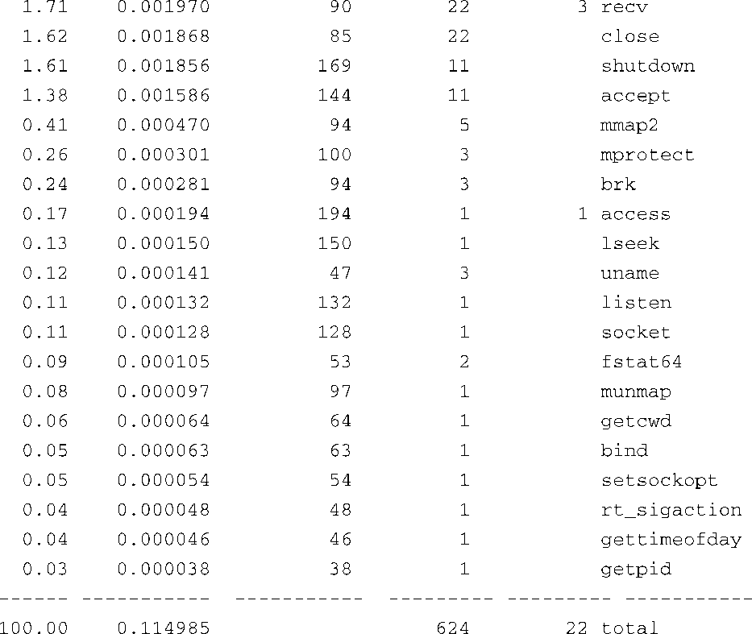

### 13.4.2　strace命令行选项

strace实用程序有很多命令行选项。其中一个最有用的功能就是可以选择只追踪系统调用的一个子集。比如，如果只想观察一个进程的网络相关的活动，可以输入以下这条命令：

这条命令只会追踪所有与网络相关的系统调用，比如 `socket()` 、 `connect()` 、 `recvfrom()` 和 `send()` 。这是一种观察进程网络活动的有力途径。还可以设置其他一些子集。例如，你可以只观察进程中跟文件相关的活动，包括 `open()` 、 `close()` 、 `read()` 和 `write()` 等系统调用。其他可用的子集还包括进程相关的系统调用、信号相关的系统调用和进程间通信相关的系统调用。

值得注意的是，strace能够追踪那些会生成其他进程的程序。如果在调用 `strace` 时加上 `-f` 选项，strace就会追踪那些由 `fork()` 系统调用创建的进程。strace命令的功能很多。熟练掌握这个强大工具的最佳途径就是使用它。特别留意一下我们介绍的这几个工具，找出它们最新的开源文档并仔细阅读。在这种情况下，大多数Linux主机上的man strace就能提供足够的信息，光是试验就能花费你整个下午的时间！

strace的 `-c` 选项也非常有用。这个选项会生成一份关于应用程序的高层次性能分析报告。使用 `-c` 选项时，strace会收集每个系统调用的统计数据，包括调用次数（calls）、出错次数（errors）以及时间开销（seconds）。代码清单13-6显示了一个例子，其中我们使用 `strace -c` 对前面介绍过的webs演示程序进行性能评测。

代码清单13-6　使用strace进行性能评测

这是一个从较高层次剖析应用程序的有效途径，它能够分析出应用程序在哪儿花费了时间，以及在哪儿出现了错误。有些错误可能是应用程序正常运行的一部分，但其他一些耗时的错误也许并不是你所期望的。从代码清单13-6中我们可以看到，持续时间最长的系统调用是 `execve()` ，shell正是使用这个系统调用来创建应用程序的。你还可以看到，它只被调用了一次。另一个有趣的现象是， `send()` 系统调用是最常用的一个。这合乎情理，因为这个应用程序是一个小型Web服务器。

请记住，和我们在这里讨论的其他工具一样，strace必须是针对目标架构编译的。strace是在目标板上执行，而不是在开发主机上。你所使用的strace版本必须与目标架构兼容。如果购买商业嵌入式Linux发行版，你应该确保针对你所选架构的产品中包含了这个工具。

