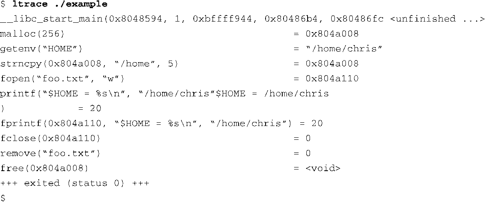
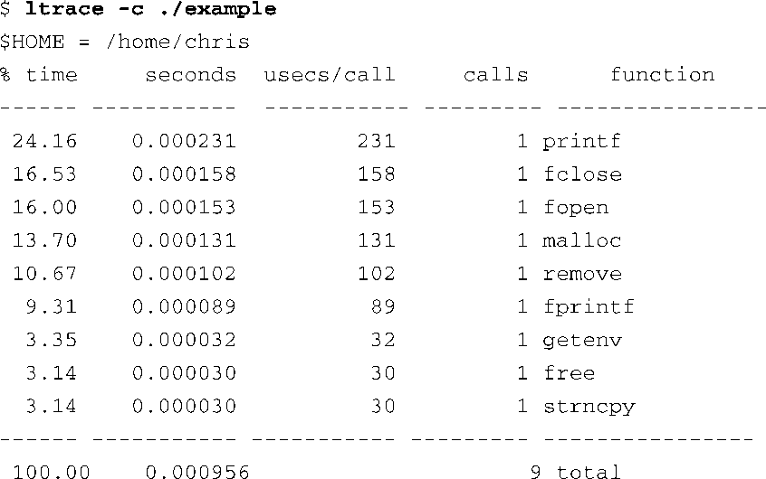

### 13.4.3　ltrace

ltrace和strace密切相关。ltrace追踪的是程序库调用，而strace追踪的是系统调用。它们的执行方式也是类似的。你只需要在应用程序前面加上追踪工具就行了，像下面这样：

代码清单13-7显示了我们使用ltrace追踪一个小程序时的输出，这个示例程序调用了一些标准C程序库中的函数。

代码清单13-7　 ltrace 输出示例

对于每个程序库调用，代码清单中显示了它的名称及传入参数。与strace类似，代码清单中接着显示了程序库调用的返回值。和strace一样，这个工具也可以用于追踪那些没有源码可参考的程序。

与strace类似，ltrace也有很多能够影响其行为的命令行选项（开关）。可以显示出程序在调用每个库函数时的PC（Program Counter）值<a class="my_markdown" href="['#anchor138']">[8]</a>，这能够帮助你理解应用程序的执行流程。和strace一样，你也可以使用 `-c` 选项来收集一些统计数据，比如调用次数、错误次数和消耗时间等，从而对应用程序做一个简单的性能评测。代码清单13-8显示了一个ltrace命令的例子，其中我们使用 `-c` 选项追踪了一个简单的示例程序。

代码清单13-8　使用ltrace进行性能评测

<a class="my_markdown" href="['#ac138']">[8]</a>　使用 `-i` 选项。——译者注

ltrace只适用于那些在编译时使用动态链接库的程序。这通常是应用程序的默认编译方式，所以，除非你在编译时指定了编译器的 `-static` 选项，否则你就可以使用ltrace来追踪编译出的二进制应用程序。还有一点和strace类似的是，你必须使用针对目标架构编译的ltrace二进制文件。这些工具运行在目标板上，而不是主机开发系统上。

