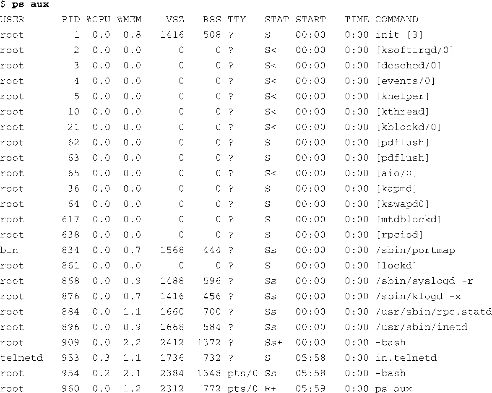

### 13.4.4　ps

在众多开发工具中，除了strace和ltrace之外，最容易被嵌入式系统开发人员忽视的工具就属top和ps了。因为每个工具都有大量可用的命令行选项，我们可以轻松地为它们专门写上一章，详细讲述这两个有用的系统性能评测工具。几乎所有的嵌入式Linux发行版中都包含了它们。

这两个工具都使用了我们在第9章中介绍过的/proc文件系统。如果你知道在/proc文件系统中查找哪些地方以及如何解析得到的数据，你就能够从中了解到这些工具所传达的大部分信息。这些工具以一种方便的形式展现了这些信息，让人更容易理解。

ps可以列出一个机器上所有运行的进程。然而，它相当灵活，能够提供大量有关机器和进程状态的有用数据。例如，ps可以显示出每个进程的调度策略。对于那些使用了实时进程的系统来说，这个功能特别有用。

如果不带任何命令行选项，ps会显示所有满足以下条件的进程：它们的用户ID和执行此命令的用户相同，而且它们所关联的终端就是输入命令的终端。当一个用户在终端中生成了很多任务时，这种不带选项的执行方式很有用。

向ps传递命令行选项会让人感到困惑，因为ps支持很多标准（POSIX与UNIX）以及3种不同的选项风格：BSD、UNIX和GNU。一般来说，BSD选项是指一个或多个字母，不包含短划线（-）。UNIX选项是我们熟悉的短横加字母的组合，而GNU使用的是长参数格式，前面有两个短划线（--）。请查看ps的帮助手册以了解更多详细信息。

每个使用ps的人都有各自喜好的执行方式。一个特别有帮助的通用执行方式是 `ps aux` ，这会显示出系统中的每个进程。代码清单13-9是一个在嵌入式目标板上执行 `ps aux` 的例子。

代码清单13-9　进程列表

这只是使用ps查看输出数据的多种方式中的一种。各个列的含义如下。

+ USER和PID字段一目了然。
+ %CPU字段表示自从进程创建以来的CPU使用百分比，因此，CPU的使用几乎不会累积到100%。
+ %MEM字段代表了进程的驻留内存大小占所有可用物理内存大小的百分比。
+ VSZ字段是进程的虚拟内存大小，单位是KB。
+ RSS是指驻留内存大小（Resident Set Size）。它代表的是一个进程使用的未交换的（实际驻留在内存中的）物理内存大小，单位也是KB。
+ TTY是进程的控制终端。

这个例子中的大多数进程都没有和控制终端相关联。生成代码清单13-9的ps命令是从一个Telnet会话中发出的，代码清单中的终端设备pts/0表明了这一点。

STAT字段描述了在显示这个进程列表时的进程状态。S表示进程正在睡眠，等待某种类型的事件，一般是I/O事件。R表示进程处于可运行的状态（也就是说，如果没有更高优先级的进程等待执行，进程调度器就可以将CPU的控制权交给这个进程）。状态字符旁边的尖括号表示这个进程具有较高的优先级。

最后一列是命令的名称。显示在方括号中的是内核线程。ps还有很多其他可用的符号和选项，请参考ps的帮助手册以了解完整的详细信息。

